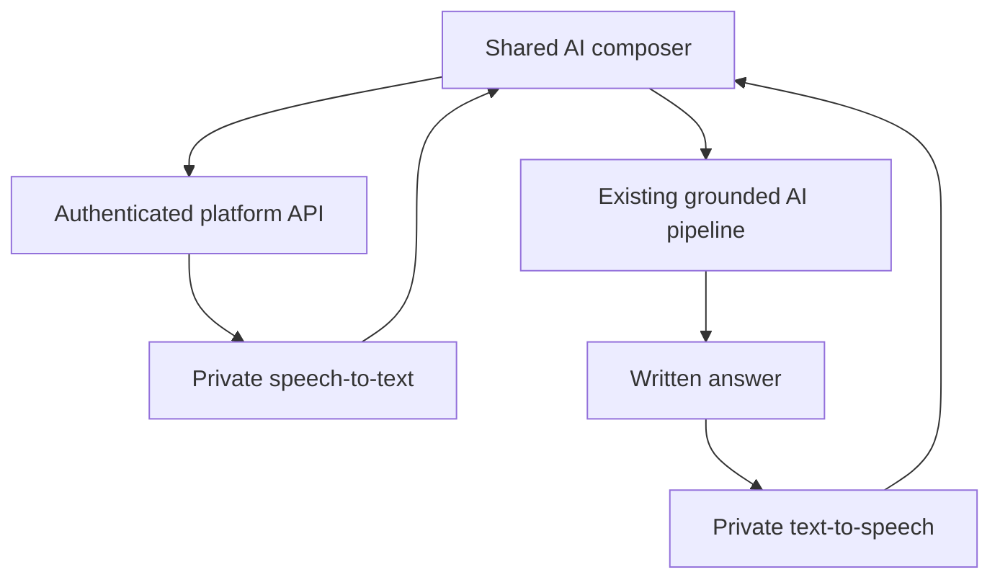

# TableScope Devin-Ready Implementation Plan

## AI Composer Reliability, Private Voice Conversation, Data Performance, Connector Carousel, and Auto-Height Home Pins (Validated and Enhanced)

**Status:** Ready for implementation
**Recommended branch:** `devin/ai-experience-performance-connectors-home-pinning`
**Base branch:** `devin/mobile-responsive-voice-input`. This is confirmed, not assumed — it is the branch that produced the shared `AskAnythingComposer` and private voice-input work (see section 0.2), it is what `release/deploy-2026-08-07` was fast-forwarded from for the two most recent shipped fixes (PR #168 `c9467588`, PR #169's insight-card-match confidence-floor fix), and it is the branch the last two live deployments and verifications ran against. Before coding, `git fetch origin devin/mobile-responsive-voice-input` and diff against the SHA recorded here — more PRs may land between this document being written and Devin starting.
**Repository:** `lhoskins/tablescope-lh`
**Visual reference:** `Picture48.png` / the attached "Create Data Sources" carousel mockup. Confirmed by the requester: this is a design mockup, not a screenshot of an already-live carousel — see section 0.4.

---

## 0. Validation notes and corrections

This section records what changed after checking the submitted plan against the actual repository (verified against `origin/devin/mobile-responsive-voice-input` at `c9467588`, and cross-checked against `origin/release/deploy-2026-08-07` at `6a3c1f16`, the branch actually serving `app.tablescope.cloud`). Nothing here rejects the plan's architecture or requirements — the shared-composer, private-voice, evidence-driven-performance, and auto-height-grid designs are all correct and unchanged. This sharpens scope so Devin isn't rebuilding what already ships, and isn't fooled into thinking something ships when it doesn't.

### 0.1 The recommended base branch in the original draft was wrong

The original draft didn't name a base branch at all beyond "confirm the branch deployed to `app.tablescope.cloud`." That branch is `devin/mobile-responsive-voice-input` — commit `c9467588` at the time of this review, most recently fast-forwarded into `release/deploy-2026-08-07` for the Ask Anything insight-card-match fixes (PRs #168 and #169). `main` is roughly 700 commits and 16,000+ files behind this lineage and is not the deployment branch in practice; do not branch from or merge into `main` for this work. Section 2's branch table below is corrected to build everything on top of `devin/mobile-responsive-voice-input`, and to merge back into it (then re-deploy `release/deploy-2026-08-07` the same way the last two PRs were shipped) rather than into an unspecified "canonical release/deployment branch."

### 0.2 Workstream A's premise is half-shipped: a shared composer already exists

A prior cycle's validated plan (`docs/devin-mobile-responsive-voice-input-validated-plan.md`, commit `125ed6f8`) found no shared composer and made building one a prerequisite. That work landed. Today:

- `web-ui/components/ai/ask-anything-composer.tsx` is a real shared `AskAnythingComposer`, and it is already used by all the required surfaces: `components/tablescope/project/ai-assistant-screen.tsx` (AI Assistant), `components/tablescope/home/insight-ask-box.tsx` and `components/tablescope/home/ai-suggestions/home-ask-box.tsx` (Business/Project Insight and Home ask boxes), `app/ai/page.tsx`, and `components/dashboard/DashboardTab.tsx` (the former `AIPromptBar`/`SpeechRecognition` dashboard-generation surface the prior plan flagged as a stray fourth mic implementation — it has since been folded into the shared composer, so that specific risk is closed).
- The two-line-growing-to-eight-line textarea already exists as a shared primitive: `web-ui/components/ui/autosize-textarea.tsx` takes `minRows`/`maxRows` (used with `minRows=2, maxRows=8` in the composer), computes height from `scrollHeight` against the element's real computed line-height, and tracks `isComposing` for IME safety. Section 6's requirements are close to already met — treat this as an audit-and-close-gaps task (confirm max-height internal scroll behavior, mobile safe-area/keyboard clearance, and recalculation on paste/transcript-insert/container-resize/font-load), not a build-from-scratch task.
- Private voice **input** already ships end-to-end: `web-ui/hooks/use-voice-recorder.ts` (`useVoiceRecorder`) drives recording, `web-ui/lib/api/voice.ts` (`transcribeAudio`) calls the platform API, which reaches `ai-server/tablescope-ai-api/app/services/speech_service.py` — a **CPU-based `faster-whisper`** model (`settings.voice_transcription_device`/`voice_transcription_compute_type` are configurable, defaulting off-GPU per the prior plan's contention finding in its own section 0.6), gated by a platform toggle (`platform-api/app/config.py:148`, `voice_input_enabled`) plus the per-tenant column pattern that plan established. The composer already shows recording/transcribing states, inserts an editable (not auto-submitted) transcript, and degrades to typed input on permission-denied/unsupported. Section 8-12's voice-**input** requirements are therefore mostly already satisfied; verify against the acceptance criteria in section 37 rather than re-implementing.

What is **not** built, confirmed by searching the full commit history (`git log --all --grep`) for cancellation/abort and speech-synthesis work and finding nothing on any branch:

- **AI request cancellation is genuinely new.** The only `AbortController` usage anywhere in `web-ui` is for the unrelated Home-intelligence background feed (`components/tablescope/home/use-intelligence-feed-state.ts`, `lib/api/home-intelligence/stream-home-intelligence.ts`) — nothing wires a Stop control to an in-flight Ask Anything/AI Assistant request, client or server side. Workstream A section 7 (Cancel pending or streaming AI requests) stands as fully net-new work, with the shared composer (`ask-anything-composer.tsx`) as the one integration point for the Stop UI across all four surfaces.
- **Text-to-speech / spoken replies are genuinely new.** No `synthesize`/`speak`/TTS code exists anywhere in `web-ui`, `platform-api`, or `ai-server`. Workstream B's *output* half (section 8's "spoken answer," section 9's TTS leg, section 11's TTS model packaging) is net-new. Reuse the STT path's precedents directly: the same CPU-first-then-measure posture (a small local CPU-viable TTS model such as Piper is a reasonable default given the GPU is already contended, per the prior plan's finding — measure before considering GPU), the same HMAC-signing/short-timeout convention `speech_service.py`'s transcription call already established, and the same `voice_input_enabled`-style tenant toggle pattern for a new `voice_output_enabled`.
- **Before implementing the "Sh" partial-prompt race (section 4-5): reproduce it first, don't assume it still exists.** `AutosizeTextarea` already reads the textarea's live value at each keystroke rather than a debounced copy, and the shared composer already centralizes submission through one path instead of the three-plus independent handlers the prior plan found. It's plausible the race was a symptom of the pre-consolidation scattered composers and is already gone. Follow the plan's own section 4 reproduction matrix against the *current* composer before writing a fix for a bug that may no longer reproduce; if it's gone, say so in the PR with the negative reproduction evidence instead of adding speculative guards.

### 0.3 Workstream C: recent Teiid/pool work may have already addressed part of the complaint

`devin/mobile-responsive-voice-input` includes a recent, dense run of Teiid/VDB performance commits: lazy pool creation, warm-connect timeout tuning (45s→60s), per-view capability caching, bounded idle pools, sequential warming to avoid saturation, and non-blocking VDB pre-warm (`6713d0a5`, `7b29141b`, `10d30fdb`, `8c3e1122`'s predecessors, and others — `git log --oneline --grep="perf(teiid)"` on the base branch). This is exactly the kind of pool/translator-latency work section 13-18 asks Devin to investigate. Before instrumenting from zero: diff against these commits, re-run the section 13 baseline against the *current* base branch (not a pre-fix commit), and scope new work to whatever the fresh trace shows is still slow — most likely the Data Sources/Tables **list API** layer (N+1s, pagination, per-row translator health checks) rather than the connection-pool layer this recent work already targeted. If the baseline shows the pool work already closed the gap, say so with evidence rather than re-tuning already-tuned pool settings.

### 0.4 Workstream D: no connector carousel exists anywhere — the attached image is the design mockup, confirmed

Searched the full commit history (`git log --all --grep="carousel"`, `"installed connector"`) and the actual code on both `devin/mobile-responsive-voice-input` and the live `release/deploy-2026-08-07` tip: the "Installed connectors" section (`web-ui/components/tablescope/database-connectors/workspace.tsx:154-225`) is a plain responsive CSS grid — `grid grid-cols-1 sm:grid-cols-2 lg:grid-cols-3 xl:grid-cols-4` — with no paging, no arrows, no row cap. There is no partially-built or abandoned carousel attempt anywhere to search for or port; this is fully net-new component work sitting directly on top of the existing `installed` react-query data source in that same file (data fetching does not need to change, only rendering/layout).

The image attached alongside this plan shows what looks like an *already-running* two-row carousel — left/right chevrons, cards mid-transition, some visibly overlapping/cropped text — and matches no code found anywhere in this repository's history. **Confirmed by the requester: this is the design mockup**, not a screenshot of an already-live page. The overlapping/cropped appearance is a mockup-tool artifact, not a bug to reproduce. Build fresh from the plain grid at `workspace.tsx:154-225` toward the section 20-23 spec below; do not go looking for a broken live carousel to fix, and do not literally reproduce the mockup's overlap/cropping — those are section 20's explicit non-goals ("no overlapping cards, cropped text").

### 0.5 Workstream E: a Home pins grid already exists and already has the exact clipping defect described

`web-ui/components/tablescope/home/home-pins-grid.tsx` already renders pinned insights through `react-grid-layout`'s `ResponsiveGridLayout` with a fixed `rowHeight={GRID_ROW_HEIGHT}`, and `web-ui/components/tablescope/home/home-pins-grid/pin-card.tsx` wraps the pinned content in `className="min-h-0 flex-1 overflow-auto"` (lines 113 and 146) — a fixed-height container with internal scrolling, precisely the anti-pattern section 27 prohibits. This is the correct, current target for the fix; section 24-28 as written (reproduce, pin-by-reference, `ResizeObserver`-driven `gridRows` calculation feeding the grid item's row-height prop, remove the `overflow-auto`/fixed-height wrapper) applies directly to these two files with no architectural changes needed. The plan's proposed formula (`gridRows = Math.ceil((contentHeight + verticalGap) / (rowHeight + verticalGap))`) maps directly onto `ResponsiveGridLayout`'s per-item `h` (row count) prop already in use here.

One thing to actively avoid: a *second*, older, abandoned Home/Dashboard grid implementation exists on a stale, never-merged lineage (`devin/prompt-6-home-dashboard-grid`, and its sibling `devin/prompt-4-autosize-chat`) that forked from a common ancestor many weeks before `devin/mobile-responsive-voice-input` branched off and was never merged forward — `git merge-base --is-ancestor` confirms neither branch is an ancestor of the current base. It also uses `react-grid-layout` and touches pin persistence, which makes it look like exactly the kind of "earlier working implementation" section 2 step 4 asks Devin to search for and port. Do not port it: it predates most of the last several weeks of Insight/AI/Teiid work on the current lineage and merging it forward would reintroduce that regression risk for no benefit, since the current live `home-pins-grid.tsx` already has the grid infrastructure — it only needs the auto-height fix, not a replacement implementation.

### 0.6 Nothing above changes scope, non-negotiable requirements, or acceptance criteria

Sections 3 onward (architecture decisions, detailed requirements, testing plan, acceptance criteria, deployment sequence, rollback) are unchanged from the original submission and follow after this notice. Where a section's premise was corrected above (composer existence, voice-input existence, Home-grid existence, Teiid pool state), treat that section as "verify and close remaining gaps" rather than "build from nothing" — the acceptance criteria themselves are still the right bar.

---

## 1. Objective

Correct the AI prompt submission defect and modernize the shared AI interaction experience, diagnose and restore Data Sources/Tables performance, compact the installed-connector catalog, and ensure pinned Home insights render at their complete natural height without vertical scrollbars.

The completed release must:

1. Never submit a partial prompt such as `Sh` because typing and Enter raced.
2. Let a user cancel a pending or streaming AI request.
3. Provide a two-line composer that grows as the user enters additional lines.
4. Provide private speech input and spoken responses on AI Assistant, Business Insights, Project Insights, and Project Home.
5. Restore acceptable Data Sources and Tables performance, including translator-backed sources, based on measured evidence.
6. Display installed connectors as a compact, responsive, two-row carousel with seven connectors per row on supported desktop widths.
7. Pin an insight or widget to Home at its complete content height, with no vertical scrollbar inside the pinned card.

Do not create four page-specific AI composers, add arbitrary timeout increases, use public browser speech services, or solve the Home problem with a hard-coded height.

---

## 2. Branch, merge, and delivery strategy

This work touches separate risk domains. Use one integration branch — **`devin/ai-experience-performance-connectors-home-pinning`, branched from the current tip of `devin/mobile-responsive-voice-input`** (see section 0.1; do not use `main`) — but deliver four independently reviewable commits or stacked PRs:

| Workstream | Suggested commit/stacked branch | Current state (section 0) |
|---|---|---|
| Shared AI composer, cancellation, STT/TTS | `devin/ai-composer-private-voice` | Composer + STT already ship; cancellation and TTS are net-new |
| Data Sources/Tables performance | `devin/data-source-table-performance` | Teiid pool layer recently hardened; re-baseline before assuming the original complaint still applies at the same layer |
| Connector carousel | `devin/connector-catalog-carousel` | Fully net-new; attached image is the design mockup, confirmed (section 0.4) |
| Home pin auto-height | `devin/home-pin-auto-height` | Grid infra already exists (`home-pins-grid.tsx`); fix targets the existing `overflow-auto`/fixed-`rowHeight` wrapper, not a new grid |

Before editing:

1. Fetch all branches and pull-request refs.
2. Identify the exact branch and commit deployed to `app.tablescope.cloud` — confirmed as `devin/mobile-responsive-voice-input`, most recently reached production via `release/deploy-2026-08-07` fast-forwarded past PRs #168/#169. Re-confirm the current SHA; more may have landed since.
3. Confirm the base contains the latest:
   - canonical Business/Project Insight conversation work;
   - Project Home shared Ask Anything composer — confirmed present, section 0.2;
   - unified Connected Sources/Data Source Builder work;
   - current database and SaaS connector catalog;
   - Home dashboard-grid/pinning implementation — confirmed present, section 0.5;
   - current LLM streaming and AI request API.
4. Search all Git history for any earlier working dynamic composer, microphone, request cancellation, translator pooling, connector carousel, and auto-height grid implementation. Port working code intentionally instead of recreating it on the wrong lineage — but see sections 0.4 and 0.5 for two specific traps this search surfaces (no carousel exists anywhere to find; a stale, non-ancestor Home-grid branch exists and must **not** be ported).
5. Record the production SHA, base SHA, feature SHA, and any ported commits in the PR description.
6. Merge into `devin/mobile-responsive-voice-input` (the branch actually reaching production), then re-deploy `release/deploy-2026-08-07` the same way as the prior two PRs — not into `main`, and not only into a throwaway feature lineage.

Do not combine unrelated formatting changes or dependency upgrades with this work.

---

## 3. Shared product and architecture decisions

### 3.1 One shared AI composer

AI Assistant, Business Insights, Project Insights, and Project Home must use the same shared composer component and request lifecycle hook. The pages may supply different tenant/project context, conversation destination, and suggested prompts, but must not maintain separate submission, microphone, cancellation, or resizing logic. This is already true today for submission/microphone/resizing (section 0.2) — extend the same `AskAnythingComposer` for cancellation rather than introducing a second lifecycle hook.

Conceptual contract:

```tsx
<AIComposer
  surface="ai-assistant | business-insights | project-insights | project-home"
  tenantId={tenantId}
  projectId={projectId ?? null}
  conversationId={canonicalConversationId}
  onSubmit={submitQuestion}
  onCancel={cancelActiveRequest}
  voiceEnabled={capabilities.voice}
  spokenReplyEnabled={capabilities.spokenReply}
/>
```

Use repository conventions and existing components where names differ — in this codebase that is `AskAnythingComposer` in `web-ui/components/ai/ask-anything-composer.tsx`.

### 3.2 Private voice processing

- Capture audio only after the user taps the microphone. *(Already true.)*
- Transcribe inside TableScope's isolated AI environment using a locally installed speech-to-text model. *(Already true — CPU `faster-whisper`, section 0.2.)*
- Generate spoken answers using a locally installed text-to-speech model. *(Net-new, section 0.2.)*
- Do not use browser `SpeechRecognition`, Apple, Google, Microsoft, or another public speech API as the primary path. *(Already true; the one prior browser-`SpeechRecognition` surface was retired during composer consolidation — verify it is still gone.)*
- Do not allow the isolated AI server to download models at runtime.
- Stage signed model artifacts through the existing LLM Framework/model-vault deployment path.
- Do not retain raw user audio or generated response audio by default.
- Preserve the written answer as the canonical conversation record. Generated speech is a transient presentation of that answer.

### 3.3 Performance work must be evidence-driven

Do not make slow pages appear successful by extending timeouts. Instrument the complete request path, identify the slow stage, repair the cause, then define timeouts from measured service-level objectives. Re-baseline against the current branch first (section 0.3) — recent Teiid pool work may have already moved the numbers.

### 3.4 Responsive connector catalog

The seven-by-two layout applies to wide desktop space. At narrower widths, reduce the visible number of columns without shrinking cards below their accessible minimum width. Maintain at most two rows and use horizontal paging.

### 3.5 Pinned content uses natural height

The Home grid owns placement, not content clipping. A pinned insight reports its rendered height to the grid, and the grid allocates enough rows. Do not place a fixed-height overflow container around the insight — today `pin-card.tsx` does exactly that (section 0.5) and is the concrete thing to remove.

---

# Workstream A — AI Composer Reliability and Cancellation

## 4. Reproduce and diagnose the partial-prompt defect

Reproduce the visible `Sh` pending request with:

- fast typing followed immediately by Enter;
- browser automation using `type` plus `press_enter`;
- pasted text followed immediately by Enter;
- IME/composition input;
- slow mobile keyboards;
- React state updates under CPU throttling;
- a previous response still streaming;
- multi-line input with Enter and Shift+Enter.

Inspect:

- controlled/uncontrolled textarea state;
- stale closure usage in `onSubmit`;
- debounced input state;
- keydown ordering versus input/change events;
- form submit and button handlers both firing;
- automation helpers that type and press Enter without asserting the final value;
- duplicate request creation and idempotency behavior.

Add a failing regression test before changing behavior. **Per section 0.2, confirm this still reproduces against the current `AskAnythingComposer`/`AutosizeTextarea` before writing a fix — it may already be closed by the composer consolidation, in which case document the negative reproduction instead of adding speculative guards.**

## 5. Correct prompt submission semantics

Implement these rules:

1. The submitted payload must come from the composer's canonical current value at form-submit time.
2. Never debounce the state used for submission. A debounced copy may be used for suggestions or analytics only.
3. Trim for validation but preserve intentional internal whitespace and line breaks.
4. Do not submit an empty or whitespace-only prompt.
5. `Enter` submits only when:
   - Shift is not pressed;
   - composition is not active (`event.isComposing` is false);
   - no voice transcription is currently being inserted;
   - submission is allowed.
6. `Shift+Enter` inserts a newline.
7. Prevent duplicate form and key-handler submission.
8. Generate a client request ID/idempotency key before sending. The server must reject or return the existing request for a duplicate key.
9. Do not insert a pending user message into the conversation until the API accepts the complete non-empty payload.
10. Preserve the text if submission fails. Clear the composer only after acceptance.

For automated UI tests, use an atomic `fill()` operation where possible and assert the complete textarea value before pressing Enter. Do not repair the test with arbitrary sleeps.

## 6. Two-line dynamic composer

Required behavior on all four surfaces (largely already implemented by `AutosizeTextarea` — verify against every bullet below rather than reimplementing):

- Initial height: two text lines, including padding.
- Grow vertically as content wraps or the user inserts new lines.
- Maximum: eight visible lines or the existing design-system equivalent; after that, the textarea may scroll internally.
- Recalculate on input, paste, transcript insertion, container resize, font load, and value reset.
- Reset to the two-line minimum after a successful send.
- Never shrink below two lines.
- Keep microphone, Stop/Cancel, and Submit controls aligned with the bottom of the composer.
- On mobile, keep the composer visible above the software keyboard and safe-area inset.
- Use `ResizeObserver` or textarea `scrollHeight`; avoid fixed page-specific heights.

Suggested CSS behavior:

```css
min-height: var(--ai-composer-two-line-height);
max-height: var(--ai-composer-eight-line-height);
overflow-y: auto;
resize: none;
```

## 7. Cancel pending or streaming AI requests

### UI states

| State | Primary control |
|---|---|
| Idle with no text | Submit disabled |
| Idle with text | Submit enabled |
| Sending/queued/thinking | Submit becomes **Stop** |
| Streaming | **Stop generating** remains available |
| Cancel requested | Disabled spinner with `Stopping…` |
| Cancelled | Status `Stopped by you`; composer retains focus |
| Failed | Retry and editable original prompt |

### Cancellation architecture

1. Create an `AbortController` for the client fetch/stream.
2. Assign a durable AI execution/request ID on the server.
3. Add or reuse an authenticated cancellation endpoint, for example:

   `POST /api/ai/requests/{request_id}/cancel`

4. Verify tenant, user, conversation, and project authorization before cancelling.
5. Propagate cancellation through platform API, job queue/Redis if used, AI orchestrator, tool/query execution, and Ollama/model runtime where supported.
6. Mark the execution `cancel_requested` and then `cancelled`; distinguish it from `failed` and `timed_out`.
7. Stop database or translator queries where the driver supports cancellation.
8. If model inference cannot be interrupted immediately, discard later tokens/results and prevent writes or follow-on tool actions after cancellation.
9. A cancelled response must not create a partial assistant message as if it were complete. If partial text is retained, label it `Stopped` and do not treat it as grounded final output.
10. Cancellation must not delete earlier conversation messages.

Cancellation is best-effort for downstream infrastructure, but the UI must respond immediately and the server must prevent post-cancel side effects.

---

# Workstream B — Private Speech Input and Spoken Answers

## 8. Required user experience

Add a microphone immediately to the left of Submit on:

1. AI Assistant
2. Business Insights Ask Anything
3. Project Insights Ask Anything
4. Project Home Ask Anything

*(Already true for all four surfaces per section 0.2 — verify, don't rebuild.)*

The shared states are:

| State | Behavior |
|---|---|
| Available | Microphone with tooltip and accessible label `Speak your question` |
| Permission requested | Explain that TableScope privately transcribes the audio |
| Recording | Red indicator, elapsed time, **Stop recording**, and **Cancel recording** |
| Transcribing | `Transcribing…`; preserve previously typed text |
| Transcript ready | Insert editable transcript at cursor; do not submit automatically |
| Awaiting answer | Use the normal pending state with Stop available |
| Written answer ready | Render the complete normal written result |
| Spoken answer ready | Play if allowed for a mic-initiated query; otherwise show Play |

For a question initiated through the microphone, return both:

- the normal written, grounded answer; and
- an audio rendering of the same final answer.

Provide **Play/Pause**, **Replay**, **Stop audio**, and **Mute spoken replies**. If browser autoplay is blocked, retain the written answer and show a prominent Play control. Do not force spoken playback for questions entered by keyboard unless the user has enabled a `Read answers aloud` preference.

## 9. Speech service flow



The STT leg of this flow already exists end to end (`speech_service.py`, section 0.2). Only the TTS leg (right half of the diagram) is net-new.

### Suggested endpoints

- `POST /api/ai/speech/transcribe` *(already exists)*
- `POST /api/ai/speech/synthesize` *(net-new — reuse the transcribe endpoint's HMAC-signing and short-timeout convention rather than inventing a second scheme)*
- private AI-server equivalents not directly exposed to the browser

Reuse existing service authentication, tenant/project context, audit correlation IDs, and private network paths.

## 10. Audio security and lifecycle

- Use `getUserMedia` and `MediaRecorder` after an explicit user gesture.
- Support browser-emitted WebM/Opus and iOS-compatible MP4/AAC inputs.
- Validate MIME signature, duration, byte size, sample properties, and corruption server-side.
- Normalize with a pinned and patched FFmpeg build in a constrained process.
- Default maximum recording duration: 120 seconds, configurable.
- Default maximum upload: 20 MB, configurable.
- Encrypt temporary buffers and delete them on success, failure, cancellation, disconnect, and expiry.
- Do not put raw or synthesized audio in Redis, application logs, conversation storage, object storage, model training data, or analytics.
- Audit metadata only: tenant, user, project when present, surface, duration, language, status, latency, model version, and error category.
- Do not expose tenant/project data in synthesized filenames or public URLs.
- Stream synthesized audio through a short-lived authenticated response; revoke it after playback/expiry.
- Rate-limit transcription and synthesis per tenant/user.
- Apply the same content and authorization controls to voice questions as typed questions.

## 11. Model and capacity implementation

- Package one local Whisper-compatible STT model *(already done — CPU `faster-whisper`, section 0.2)* and one approved local TTS model as signed versioned artifacts.
- Install through the existing isolated LLM/model framework; no runtime internet access.
- Add health/readiness checks and independent feature flags:
  - `VOICE_INPUT_ENABLED` *(exists as `voice_input_enabled`)*
  - `VOICE_OUTPUT_ENABLED` *(net-new, same pattern)*
  - `VOICE_STT_MODEL`
  - `VOICE_TTS_MODEL`
  - `VOICE_MAX_DURATION_SECONDS`
  - `VOICE_MAX_UPLOAD_BYTES`
- Add tenant-level capability controls while preserving platform override.
- Schedule STT/TTS capacity separately from long LLM generation where possible. The AI server GPU is already known to be contended (serialized `max_jobs=1`, per the prior voice-input plan's section 0.6 finding) — this is exactly why STT defaulted to CPU, and TTS should default the same way pending measurement.
- If shared-GPU latency is unacceptable, deploy speech as a separate private AI worker. Do not silently fall back to a public speech service.

## 12. Voice error handling and accessibility

- Permission denied: explain how to re-enable the microphone and focus the text field.
- No speech: `No speech was detected. Try again or type your question.`
- Unsupported browser: disable the microphone with an explanation; typing remains functional.
- Service unavailable: preserve recorded/typed state where safe and allow retry.
- Network interruption: cancel temporary upload, stop tracks, and clean server buffers.
- Announce recording, transcription, cancellation, and playback state through an ARIA live region.
- Microphone, playback, and cancellation controls require accessible names, visible focus, keyboard operation, and at least 44×44 CSS-pixel touch targets.

---

# Workstream C — Data Sources and Tables Performance

## 13. Establish an evidence baseline before optimizing

Create a repeatable performance dataset using:

- an ordinary file-backed/native data source;
- a direct database source;
- at least two translator-backed sources;
- small, medium, and representative production-sized schema/table counts;
- warm and cold cache conditions;
- one, five, and ten concurrent authorized users.

Measure separately:

- Data Sources list API;
- Tables list API;
- schema/column metadata expansion;
- row preview;
- translator metadata lookup;
- project assignment and permission resolution.

Capture p50, p95, p99, error rate, timeout rate, query count, response bytes, pool checkout time, translator time, Teiid/VDB time, application DB time, and browser render time. Run this baseline against the current base branch (section 0.3) — not an older pre-Teiid-fix commit — so the results reflect what's actually still slow today.

## 14. Add end-to-end tracing

Instrument one correlated trace from browser to the final dependency:

```text
browser navigation
  -> platform API routing/auth
  -> tenant/project permission lookup
  -> application DB pool checkout/query
  -> Teiid/VDB request
  -> translator/remote source request
  -> serialization/compression
  -> browser rendering
```

Required spans/metrics:

- request and trace IDs;
- tenant-safe source type and translator name;
- pool acquisition duration and active/idle/waiter counts;
- connection establishment and validation time;
- number and duration of SQL/metadata calls;
- retry/backoff count and reason;
- Teiid planning/execution time;
- remote translator latency;
- cache hit/miss and cache age;
- returned row/item count and payload size;
- frontend fetch, parse, render, and hydration duration.

Do not log credentials, SQL parameter values containing customer data, unrestricted UNC paths, or returned records.

## 15. Audit hard-coded waits, retries, and timeouts

Search the current code and configuration for:

```bash
rg -n "setTimeout|sleep\(|timeout|connect_timeout|statement_timeout|pool_timeout|retry|backoff|delay|poll" web-ui platform-api ai-server docker-compose* deploy* infra*
```

Classify every result as:

- UI debounce/polling;
- connection timeout;
- pool acquisition timeout;
- query/statement timeout;
- translator timeout;
- retry delay/backoff;
- health-check delay;
- test-only wait.

Document the current effective values by environment, including the recent Teiid warm-connect/pool timeout changes (section 0.3) — treat those as intentional, recent, and evidenced, not as accidental waits to strip out by default. Remove genuinely accidental fixed waits and duplicated sequential polling. Do not increase a timeout until the trace shows that the underlying operation is healthy but legitimately needs more time.

## 16. Validate connection-pool health

Check for:

- leaked sessions/connections;
- unclosed cursors or streaming responses;
- transactions held open during remote calls;
- pool created per request instead of per process;
- pool size smaller than worker concurrency;
- excessive connection validation/pre-ping;
- stale connections after database/network events;
- synchronized pool recycling;
- unbounded request concurrency creating pool waiters;
- tenant or translator pools incorrectly sharing credentials/state;
- recent pool configuration changes and regressions — cross-reference against the section 0.3 commits specifically to see whether they introduced or resolved any of the above.

Add pool saturation alerts and a health metric. Configure pool size, overflow, acquisition timeout, recycle, and keepalive from environment settings based on measured worker concurrency. Preserve tenant isolation.

## 17. Validate Data Sources/Tables query behavior

Inspect for:

- N+1 owner, project, dependency, status, column-count, or permission queries;
- loading full schema/column definitions for collapsed rows;
- unbounded lists and client-only filtering;
- expensive counts executed on every request;
- missing indexes on tenant, project assignment, source, table, status, owner, and updated-time lookup paths;
- per-row translator health checks;
- repeated VDB metadata parsing;
- sequential requests that can be safely batched;
- oversized JSON and absent compression;
- React re-rendering every row when one row changes;
- lack of pagination or virtualization.

Implement server-side pagination/search/filtering for large lists. Load detailed columns, lineage, and preview data on demand. Batch permission and summary lookups. Add database indexes only after validating the query plan and migration impact.

## 18. Translator-specific investigation

For every translator family:

1. Separate remote-network latency from Teiid planning and TableScope API latency.
2. Verify translator metadata is not refreshed for every row or page request.
3. Cache safe, tenant-scoped schema metadata with version/TTL and explicit invalidation after source refresh or connection update.
4. Reuse healthy connections where the translator supports it — the recent per-view source capability caching (section 0.3) may already partially address this; verify before adding a second cache layer.
5. Validate predicate/projection/limit pushdown.
6. Avoid fetching all remote rows merely to show a count or preview.
7. Bound retries and use exponential backoff only for retryable failures.
8. Add circuit-breaker behavior for an unavailable remote system so one translator does not stall the entire list.
9. Render independent source rows progressively; do not block all Data Sources on the slowest translator health check.
10. Preserve an explicit `Last checked` status instead of synchronously retesting every connection during page load.

## 19. Performance targets

After capturing the baseline, record approved production SLOs. Use these initial acceptance targets unless existing TableScope SLOs are stricter:

| Operation | Warm p95 target | Cold p95 target |
|---|---:|---:|
| Data Sources first page | ≤ 1.5 s | ≤ 3.0 s |
| Tables first page | ≤ 1.5 s | ≤ 3.0 s |
| Expand schema metadata | ≤ 1.5 s | ≤ 4.0 s for translator source |
| Row preview | ≤ 2.5 s | ≤ 6.0 s for translator source |
| UI response after API completion | ≤ 300 ms | ≤ 500 ms |

If a remote customer system cannot meet the translator target, TableScope must display progressive loading, an honest source-specific state, and cancellation without blocking unrelated sources.

Publish a before/after report with traces and query plans. A passing functional test alone is not sufficient.

---

# Workstream D — Compact Two-Row Connector Carousel

## 20. Desktop layout

Refactor **Installed connectors** (`web-ui/components/tablescope/database-connectors/workspace.tsx:154-225` — currently a plain `grid grid-cols-1 sm:grid-cols-2 lg:grid-cols-3 xl:grid-cols-4`, section 0.4) using the attached image as intent, not pixel-perfect source code.

At a sufficiently wide desktop container:

- maximum seven connector cards per row;
- maximum two visible rows;
- up to fourteen connectors visible per carousel page;
- compact equal-width/equal-height cards;
- connector icon, name, type, readiness status, and **Create connection** remain visible;
- no overlapping cards, cropped text, or duplicate background catalog beneath the carousel;
- left/right navigation appears only when more content exists in that direction;
- navigation moves by one logical page (up to fourteen items), with optional trackpad/touch scrolling and snap alignment.

Recommended implementation:

- semantic region with an accessible name;
- internal CSS Grid using `grid-template-rows: repeat(2, auto)` and column-oriented auto-flow, or a proven design-system carousel;
- `ResizeObserver` to compute columns from container width;
- deterministic item ordering;
- no duplicated DOM solely to create an infinite loop.

## 21. Responsive behavior

| Available width | Visible columns | Rows |
|---|---:|---:|
| Wide desktop | 7 | up to 2 |
| Desktop/laptop | 5–6 | up to 2 |
| Tablet | 3–4 | up to 2 |
| Phone | 1–2 | up to 2 |

Use a card minimum width derived from actual content and 44px controls. Seven columns is a maximum target, not permission to make text unreadable.

## 22. Carousel interaction and accessibility

- Arrow controls sit outside the card content and must not cover cards.
- Disable/hide Previous at the beginning and Next at the end.
- Update arrows after resize, filtering, connector installation, and scrolling.
- Support mouse, touch, trackpad, keyboard, and screen readers.
- Arrow buttons require accessible labels such as `Previous connectors` and `Next connectors`.
- Announce the visible range, for example `Connectors 15 through 28 of 31`.
- Preserve focus on a connector after page movement when movement was keyboard initiated.
- Respect reduced-motion preferences.
- Use stable connector IDs as keys.
- Preserve existing create-connection forms, permissions, readiness checks, and connection APIs — the `installed`/`created` react-query data in `workspace.tsx` does not need to change, only its rendering.
- Do not recreate connector records when paging.

## 23. Connector tests

Test catalogs containing 0, 1, 7, 8, 14, 15, 28, and 29 connectors at all supported breakpoints. Validate:

- exact item order and no duplicates;
- maximum two rows;
- seven columns only where width permits;
- correct arrow visibility and disabled states;
- resize from wide desktop to phone and back;
- keyboard/tab order and screen-reader labels;
- modal opens for the correct connector after paging;
- no horizontal page overflow.

---

# Workstream E — Home Pinning with Automatic Height

## 24. Reproduce the pinning defect

Test pins originating from:

- Business Insights;
- Project Insights;
- line, bar, pie/donut, KPI, table, and combination insights;
- cards with long titles and summaries;
- percent-change controls and calculation details;
- desktop, tablet, and phone widths;
- cards before and after fresh data/resurfacing updates.

The clipping layer is already identified (section 0.5): `web-ui/components/tablescope/home/home-pins-grid/pin-card.tsx` lines 113 and 146 (`min-h-0 flex-1 overflow-auto`), sitting inside `web-ui/components/tablescope/home/home-pins-grid.tsx`'s `ResponsiveGridLayout` with a fixed `rowHeight={GRID_ROW_HEIGHT}`. Confirm this against the reproduction matrix above, but do not spend time re-locating the layer — start here.

## 25. Pin by reference, not stale presentation copy

The pin record must retain a stable insight/widget identity and governed display preferences, not a stale serialized DOM snapshot. On Home:

- load the latest authorized insight data;
- preserve the user's selected chart/view configuration where supported;
- show a clear unavailable state if the source was removed or permission revoked;
- never cross tenant/project boundaries;
- display last-updated information;
- retain the pin across resurfacing while updating its underlying content.

## 26. Automatic grid-height algorithm

1. Render the pinned content without a fixed vertical content height.
2. Measure its complete rendered height using `ResizeObserver` on the card content wrapper.
3. Convert pixels to grid rows using the actual grid row height and vertical margin:

```ts
gridRows = Math.ceil((contentHeight + verticalGap) / (rowHeight + verticalGap));
```

This maps directly onto `ResponsiveGridLayout`'s existing per-item `h` prop in `home-pins-grid.tsx` — no grid-library change is required (section 0.5).

4. Update the saved/runtime grid item only when the calculated row count changes.
5. Debounce or animation-frame batch resize events to prevent feedback loops.
6. Remeasure after:
   - chart initialization and ECharts resize;
   - fonts load;
   - image/table content loads;
   - responsive width changes;
   - interval/range or Value/% Change changes;
   - insight refresh/resurfacing;
   - More Actions expansion/collapse if that state is available on Home.
7. Set the grid item's minimum height to the measured full content height.
8. If the user may resize vertically, do not allow a resize below the current content minimum.

Implement one shared `useGridItemAutoHeight` hook instead of page-specific calculations, and use it to replace the `overflow-auto` wrapper in `pin-card.tsx` directly rather than adding a second implementation alongside it.

## 27. Scrollbar and overflow rules

- No vertical scrollbar on the pinned insight card or its outer grid item.
- Do not use `max-height` to force the full insight into a predetermined grid size.
- The Home page owns normal vertical scrolling.
- A genuinely wide table may keep an intentional internal horizontal scroller; this does not permit a vertical card scrollbar.
- If a data-table insight has many records, use the same governed preview/pagination behavior as the source insight rather than silently truncating data.
- Tooltips, menus, and chart labels must not be clipped by `overflow: hidden`.
- Recharts/ECharts canvases resize to width while preserving their designed chart height; the card then reports the resulting total height.

## 28. Layout persistence and collision handling

- After measurement, compact/reflow lower widgets without overlap.
- Persist stable grid dimensions only after layout settles; do not write on every pixel change.
- Do not allow one user's measurement to overwrite another user's Home layout.
- Preserve ordering and width during refresh.
- On mobile, use one-column natural-height stacking and disable meaningless horizontal resize.
- Migrating existing undersized pins must happen automatically on first render or through a safe layout-version migration.

---

# Cross-Cutting Implementation Requirements

## 29. Authorization and isolation

- All AI, cancellation, speech, data source, table, connector, and pin APIs must derive tenant/user/project authorization server-side.
- Never trust project or tenant IDs supplied only by the browser.
- Cancellation can target only the caller's authorized request.
- Voice processing receives the minimum required context.
- Connector catalog visibility and create actions remain role/capability controlled.
- Pinned content must be re-authorized at render and refresh time.

## 30. Observability

Add privacy-safe events and metrics for:

- prompt submission length and surface, but not raw prompt text in telemetry;
- rejected empty/partial and duplicate submissions;
- AI request queued, first token, completed, cancelled, failed, and timed out;
- STT/TTS duration, model, status, and queue wait;
- Data Sources/Tables trace timings and pool saturation;
- translator latency and circuit-breaker state;
- connector carousel navigation and layout errors;
- pin measurement, grid-row change, clipping detection, and layout failures.

Use correlation IDs across browser, platform API, AI server, Teiid, translator, and database paths.

## 31. Feature flags and rollout

Use existing flag infrastructure. Add only where absent:

- `AI_REQUEST_CANCELLATION_ENABLED`
- `VOICE_INPUT_ENABLED` *(exists — `voice_input_enabled`)*
- `VOICE_OUTPUT_ENABLED`
- `CONNECTOR_CAROUSEL_ENABLED`
- `HOME_PIN_AUTO_HEIGHT_ENABLED`

Performance fixes that correct leaks, N+1 queries, or pool configuration should not remain permanently hidden behind a UI flag, but must be canaried and rollback-safe.

---

# Testing Plan

## 32. Unit and component tests

### Composer

- Enter immediately after the last typed character submits the entire value.
- Composition/IME Enter does not submit.
- Shift+Enter adds a line.
- Empty input does not create a pending request.
- Duplicate submit uses one request ID and creates one message.
- Minimum two-line height and growth to maximum.
- Transcript insertion updates canonical value.
- Stop transitions correctly and blocks late stream tokens.

### Voice

- permission granted/denied;
- record, stop, cancel, retry;
- supported MIME formats;
- transcript remains editable and is not auto-submitted;
- mic-initiated question receives text plus audio;
- autoplay blocked fallback;
- audio cleanup on every terminal path;
- typed interaction works when voice is disabled.

### Connector carousel

- boundary catalog sizes and responsive widths;
- correct arrows, paging, ordering, focus, and connector selection.

### Pinning

- measured height-to-grid-row calculation;
- resize observer cleanup;
- no update loop;
- chart/data refresh triggers remeasurement;
- no vertical overflow at supported widths.

## 33. API and integration tests

- complete prompt stored and routed to the canonical Business/Project conversation;
- cancellation authorization, idempotency, queue removal, streaming termination, and post-cancel side-effect prevention;
- STT/TTS tenant isolation, file validation, limits, rate limits, temporary-file deletion, and service failure;
- Data Sources/Tables pagination, batching, cache isolation/invalidation, translator degraded state, and query cancellation;
- pin render reauthorization and latest-data refresh;
- connector permissions unchanged after component move/refactor.

## 34. End-to-end tests

Run on Chromium desktop, WebKit/iOS-equivalent, and Android phone viewport:

1. Type a long question rapidly and press Enter immediately; verify the full question appears once.
2. Cancel during `Thinking` and during token streaming; verify no later result or action is committed.
3. Enter eight lines; verify growth and controlled scrolling after the maximum.
4. Ask by microphone on all four surfaces; edit the transcript; send; verify written and spoken response.
5. Deny microphone permission; verify the typed path remains usable.
6. Load native and translator Data Sources/Tables under warm/cold and concurrent conditions.
7. Navigate a connector catalog larger than 28 entries using mouse, keyboard, and touch.
8. Pin every supported insight type to Home; verify complete content, no vertical card scrollbar, no overlap, and correct behavior after refresh and live data update.

## 35. Performance and resilience tests

- Pool exhaustion and recovery.
- Remote translator latency, failure, partial outage, and retry behavior.
- API request cancellation during database/translator work.
- Concurrent AI generation plus STT/TTS.
- Long spoken response and client disconnect.
- Connector resize stress and catalog updates.
- Fifty mixed pinned widgets across responsive widths, or the current supported Home limit if lower.

---

# Acceptance Criteria

## 36. AI composer

- [ ] No reproducible partial-prompt submission under rapid typing, paste, IME, automation, or CPU throttling.
- [ ] The same shared composer is used by all four required surfaces.
- [ ] Composer starts at two lines, grows to the approved maximum, and resets after send.
- [ ] Pending and streaming requests expose Stop and transition to `Cancelled`, not `Failed`.
- [ ] Late tokens, tool calls, saves, or actions cannot commit after cancellation.

## 37. Voice

- [ ] Microphone appears to the left of Submit on all four surfaces.
- [ ] Transcript is editable and never submitted automatically.
- [ ] A mic-initiated question returns the normal written answer and a spoken rendering.
- [ ] STT/TTS run inside the isolated TableScope environment with no runtime internet dependency.
- [ ] Raw and synthesized audio are transient and removed on all terminal paths.
- [ ] Voice failure never blocks typed interaction.

## 38. Performance

- [ ] Before/after trace report identifies the actual bottlenecks and fixes.
- [ ] Hard-coded waits and timeouts are inventoried; accidental delays are removed.
- [ ] Pool health, N+1 behavior, pagination, caching, and translator latency are validated.
- [ ] Approved p95 targets pass for native and translator test sources, or documented customer-network latency is isolated and shown progressively.
- [ ] No tenant/project cache or connection leakage.

## 39. Connector catalog

- [ ] Wide desktop shows no more than seven cards per row and two rows.
- [ ] More than fourteen connectors can be paged left/right without duplicates or overlap.
- [ ] Smaller screens reduce columns while preserving two-row maximum and accessible card width.
- [ ] Existing connection creation and authorization continue to work.

## 40. Home pinning

- [ ] Every supported pinned insight/widget displays at complete natural height.
- [ ] No vertical scrollbar exists within the pinned card or grid item.
- [ ] Cards do not overlap after render, refresh, resize, chart update, or resurfacing.
- [ ] Home shows current authorized insight data rather than a stale visual snapshot.
- [ ] Desktop and mobile layouts remain usable.

---

# Deployment and Validation

## 41. Deployment sequence

1. Deploy observability and capture the pre-change performance baseline.
2. Deploy the composer race fix (if still reproducible, section 4) and cancellation behind its flag.
3. Deploy TTS to the isolated AI environment and validate health before exposing UI controls. (STT is already deployed and enabled — section 0.2.)
4. Enable spoken replies for internal/admin users, then a test tenant, then production tenants.
5. Deploy measured Data Sources/Tables fixes with pool and translator dashboards active.
6. Enable the connector carousel and Home auto-height for an internal tenant.
7. Run the complete E2E and visual suite against staging.
8. Canary production, monitor for at least one full business cycle, then expand.

## 42. Required evidence in the PR/deployment report

- production and base commit SHAs;
- root cause of the `Sh` submission, or documented negative reproduction if it no longer occurs (section 4);
- cancellation state/API diagram and test evidence;
- proof that all four pages use the shared composer;
- STT/TTS model versions, artifact hashes, isolation evidence, and audio-retention validation;
- Data Sources/Tables before/after p50/p95/p99, pool metrics, query counts, and translator traces, measured against the current base branch (section 0.3);
- connector screenshots at 7, 14, 15, and 29 items plus mobile layout;
- Home screenshots for representative insight types proving no vertical internal scrollbar or overlap;
- unit, API, E2E, accessibility, and performance results;
- rollback instructions and feature-flag states.

## 43. Rollback

- Disable voice input/output without disabling typed AI.
- Disable cancellation UI only if the server cancellation path is also safely handled; do not leave a visible control that does nothing.
- Roll back pool/configuration changes independently from UI work.
- Disable carousel to restore the prior connector grid while retaining connection data.
- Disable auto-height to restore the last stable Home grid implementation; do not delete pin records.
- Never roll back by reverting unrelated later production work or deploying a stale branch.

---

# Devin Completion Instructions

Devin must not report completion after only implementing visible UI changes. Completion requires:

1. Repository discovery and correct release-lineage confirmation — already done in section 0; re-verify the SHA is still current before starting.
2. A written root-cause statement for the prompt race (or documented negative reproduction) and performance regression.
3. Shared production implementation rather than page-specific copies — already true for composer/voice-input; extend, don't duplicate.
4. Server-side cancellation and private STT/TTS, not cosmetic controls. STT already exists; TTS and cancellation are the net-new server-side work.
5. Measured native and translator performance evidence, baselined against the current branch.
6. Responsive connector and Home-pin visual evidence.
7. Passing automated tests and documented manual validation.
8. A pull request merged into `devin/mobile-responsive-voice-input`, and a successful `release/deploy-2026-08-07` re-deployment following the same process as PRs #168/#169.

If any requirement is blocked by runtime capability, GPU capacity, translator behavior, or an active branch conflict, document the exact evidence and propose the smallest safe follow-up. Do not silently omit the requirement or substitute an external public AI service.

