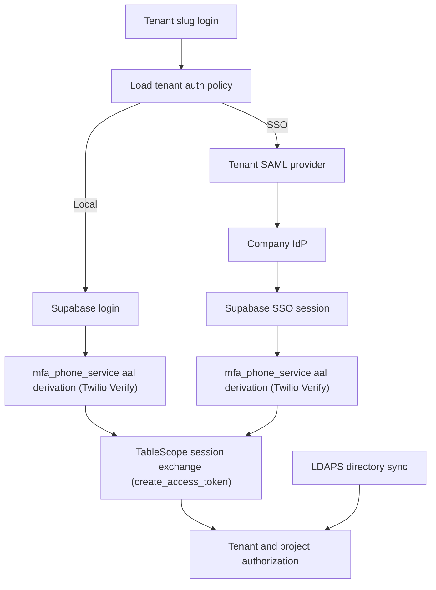

# TableScope Devin-Ready Implementation Plan — Validated & Enhanced

## Tenant LDAP Directory Synchronization and Tenant-Selective SSO

**Repository:** `lhoskins/tablescope-lh`
**Verified base:** `origin/devin/r-echarts-e2e-validation` @ `84684dd4` (merge #142, "Data Sources / Tables parity and lifecycle fixes") — re-verify at implementation time, this branch moves fast (multiple merges landed even while this validation pass was running).
**Recommended branch:** `devin/tenant-ldap-sso-enterprise-auth`
**Admin location:** `Settings → Security → Enterprise Authentication` (nav grouping; the actual URL is flat — see §5.1 correction)
**Status:** Architecture validated against the live codebase and enhanced with concrete file/pattern references. Several sections were corrected where the original draft's assumptions didn't match what's actually implemented — see §0.

---

## 0. Validation summary (read this first)

This plan was checked line-by-line against `origin/devin/r-echarts-e2e-validation`, not accepted on faith. Two categories of finding:

### 0.1 Confirmed accurate — safe to build on as written

- **PR #97 and PR #114 are both real** and describe what the plan claims. Verified via `mcp__github__search_pull_requests`: PR #97 = `feat(settings): modern TableScope Settings workspace with safe tenant API`. PR #114's merge commit (`591db9a0`) is literally titled `Merge pull request #114 from lhoskins/devin/restore-tenant-2fa-enforcement`.
- **`tenant.enforce_2fa` really is authoritative independent of the platform master switch** — confirmed via commit `e038b56c fix(2fa): make tenant enforce_2fa authoritative regardless of MFA_ENFORCEMENT_ENABLED master switch`. §17.1's warning ("do not repeat the PR #114 mistake") is well-founded and correct.
- **The FastAPI `current`-route-ordering hazard is real**, and there's a working example to copy exactly: `platform-api/app/routes/tenants_security_policy.py` declares `GET/PUT /current/enforce-2fa`-style routes (lines ~122-148) *before* the `/{tenant_id}/enforce-2fa` equivalents (lines ~149-186). Use that file as the literal template for the new enterprise-auth routes' ordering.
- **Settings → Security already exists** with Two-Factor Authentication and Allowed Domains as sibling entries, confirmed in `web-ui/components/tablescope/settings/settings-nav.tsx`.
- **The `aal2` step-up gate for sensitive tenant-security toggles has a working reference implementation** — `tenants_security_policy.py`'s `_set_enforce_2fa()` does exactly `if payload.enabled and context.aal != "aal2": raise HTTPException(409, "Verify your own phone (step-up authentication)...")`. Copy this pattern for the LDAP/SSO enable toggles.
- **A tenant-scoped, VPN-reachable private-network primitive already exists**: `tenant_data_planes` (now split into `platform-api/app/routes/tenant_data_planes_crud.py` and `tenant_data_planes_network.py`). §5.5's "tenant data plane/VPN connection selection" is pointing at a real, existing thing, not a hypothetical.
- **Encrypted-secret-at-rest is a real, working pattern**: `platform-api/app/services/crypto.py`'s `encrypt_secret()`/`decrypt_secret()` (Fernet, keyed from `TABLESCOPE_SECRET_KEY`), already used for `DatabaseDataSource.password_encrypted`, `ConnectorCredential.secret_encrypted`, and `network_file_connections.secret_encrypted`.

### 0.2 Corrected — the original draft's assumption didn't match the codebase

1. **MFA/assurance-level architecture is not Supabase-native — it's a homegrown, identity-agnostic TableScope service.** This is the single biggest correction and it *simplifies* the plan. `platform-api/app/services/mfa_phone_service.py`'s `mfa_aal_for_user(session, user_id) -> "aal2" | None` derives assurance purely from a phone-verification record keyed to the platform `User.id` (backed by Twilio Verify SMS), with **zero dependency on which identity provider authenticated the session**. It is *not* Supabase's `auth.mfa` feature. Consequence: the original §6.2's claim that "the SSO identity may need its own Supabase MFA enrollment" describes a mechanism that doesn't exist in this codebase. There is no such thing as "the SSO Supabase UUID's MFA enrollment," because aal isn't derived from Supabase claims at all — it's derived from the TableScope `User.id`. **Once an SSO login correctly resolves to the existing TableScope `user.id` (via the identity-linking table this plan already requires for other reasons), the existing aal2 check applies automatically with no additional SSO-specific MFA plumbing.** This removes an entire layer of complexity the original plan built around a wrong premise, while *keeping* every safety property it wanted (SSO sessions still gate on aal2 before a first-party token is issued). §6.2, §5.9, and §10.5 are corrected below. The §22 reference to "Supabase MFA assurance levels" doesn't apply to this implementation and has been replaced with pointers to the real files.
2. **The route/file layout the plan implicitly assumes is already out of date.** `tenants.py` and `tenant_data_planes.py` (monolithic files as of when this plan was drafted) have since been split per feature: `tenants_crud.py`, `tenants_security_policy.py`, `tenants_settings.py`, `tenants_users.py`, `tenant_data_planes_crud.py`, `tenant_data_planes_network.py` all exist today. New Enterprise Authentication routes should follow the *same* per-feature-file convention from the start (e.g. `enterprise_auth_ldap.py`, `enterprise_auth_sso.py`, `enterprise_auth_settings.py`) rather than being added to one large file that would need splitting later. §19 is corrected below.
3. **The proposed Settings URL doesn't match the real routing convention.** `/admin/settings/security/enterprise-authentication` (nested) does not match how this codebase actually routes Settings pages — they're flat: `/admin/settings/security` (Two-Factor Authentication) and `/admin/settings/allowed-domains` sit at the same level, grouped only via the nav item's `section: "Security"` metadata field, not URL nesting. **Corrected route: `/admin/settings/enterprise-authentication`.** §5.1 corrected below.
4. **A generic external-identity-token exchange endpoint already exists and should be extended, not duplicated.** `POST /api/auth/exchange` (`platform-api/app/routes/auth.py`) already accepts a third-party RS256/JWKS-verified token and mints a first-party HS256 token via `create_access_token()`, using a provider-parameterized verifier (`app/auth/clerk.py`'s `verify_external_token(token, provider=...)` — its docstring literally says "Clerk or Supabase"). **Two implications**: (a) confirm whether Clerk is still a live, configured provider anywhere before assuming this plan's Supabase-only framing is complete — don't accidentally break a dormant-but-still-reachable Clerk path; (b) the SSO callback handler this plan proposes (§6.5) should terminate by calling the *same* `create_access_token(..., extra_claims={"aal": await mfa_aal_for_user(session, user.id)})` primitive `exchange_token()` already uses, not a second, parallel token-minting code path — that's what keeps aal/permissions logic in exactly one place. §6.4/6.5 enhanced below with these exact call sites.
5. **The identity-linking gap this plan solves for is real and precisely reproducible in today's code.** `exchange_token()` resolves users by a strict `User.external_id == external_user_id` match (optionally scoped by tenant slug) with **no fallback**. An SSO login for an existing user's email, arriving with a brand-new Supabase external_id, will hit the *existing* `403 "User does not belong to requested tenant"` or `404 "No platform-api user linked to external id..."` paths today — not resolve to the person's existing account. This is exactly why §7.5's `user_auth_identities` table is necessary, and it sharpens the requirement: the SSO exchange path must consult `user_auth_identities` for a **Confirmed** mapping *before* falling back to (or instead of) the raw `User.external_id` lookup, and must return a distinct "needs identity linking" outcome rather than a bare 403/404 so the frontend can route into the identity-mapping review screen instead of just failing closed with a generic error.
6. **"Secret manager" is doing more work in the original phrasing than the codebase actually has.** There is no external vault/secrets-manager service — "the existing secret manager" *is* Fernet column encryption via `crypto.py`. Model `ldap_connections.bind_secret_encrypted` as a `Text` column through `encrypt_secret()`/`decrypt_secret()`, exactly like `network_file_connections.secret_encrypted` and `DatabaseDataSource.password_encrypted` already do. §7.2 corrected below.
7. **`ldap_connections` has a close existing schema template to copy, not invent from scratch**: migration `platform-api/alembic/versions/0079_file_import_jobs_network_connections.py`'s `network_file_connections` table already has the right shape for a tenant-scoped, secret-holding, network-reachability-tested connection record (`host`, `port`, `secret_encrypted`, `require_signing`/`require_encryption`-style booleans, `last_test_status`, `last_test_message_safe`, `last_tested_at`, `enabled`, `archived`). Model `ldap_connections` on this, and give it a `tenant_data_plane_id` FK into the *existing* `tenant_data_planes` table for the private-AD-reachability piece rather than reinventing that concept. §7.2 corrected below.
8. **A background-worker precedent more specific than "the existing worker infra" now exists.** `platform-api/app/tasks/` contains feature-specific files beyond the historical `workflows.py` monolith — `quickbooks_token_refresh.py`, `kpi_source_matching.py`, `llm_framework.py` — confirming that a new `platform-api/app/tasks/ldap_directory_sync.py` sibling file, paired with a durable, tenant-scoped, idempotent worker class analogous to `repository_scanner.py`'s `RepositoryScanner`/`create_scan()`/`scan()` (closest existing precedent: an external-source-crawling, durable, resumable, per-tenant job with its own error/status tracking), is the right shape — not a new worker technology and not necessarily routed through the aging `workflows.py`. §8.1 corrected below.
9. **A reusable, already-wired audit log exists** — `platform-api/app/models/audit_event.py`'s `AuditEvent` (table `audit_events`), despite its docstring saying "AI / intelligence actions," is *already* used by `tenants_security_policy.py` for tenant security-policy changes (`event_type="tenant_settings", scope="enforce_2fa", ...`) with an exact, copyable code shape. §13 is enhanced below with this as the default choice (with the domain-specific-table alternative, e.g. `AIGovernanceAuditEvent`/`LLMAuditEvent`, still named as a legitimate alternative if the team prefers a typed table per feature — that's a real judgment call, not something to force either way).
10. **Migration head at verification time**: `platform-api/alembic/versions/91455ab780b4_insight_feedback_review.py`. This *will* have moved by implementation time — Devin must re-run the discovery step in §3, not trust this number.

Nothing else in the original plan was found to be inaccurate. The tenant-isolation requirements, LDAP security requirements, RBAC table, phased rollout structure, and acceptance criteria in the original draft are sound, codebase-agnostic security engineering and are preserved as written below (only the sections listed above were changed).

---

## 1. Executive Objective

Add enterprise directory and sign-in capabilities without replacing TableScope's existing Supabase authentication architecture.

Implement two independent, tenant-controlled features:

1. **LDAP Directory Synchronization**
   - Optional toggle, disabled by default.
   - Reads authorized Active Directory users, security groups, and memberships through LDAPS.
   - Maps directory groups to TableScope tenant and project permissions.
   - Does **not** authenticate end-user passwords.
   - Does **not** replace Supabase login or Supabase 2FA.

2. **Company Single Sign-On**
   - Separate optional tenant toggle, disabled by default.
   - Uses a tenant-bound Supabase SAML provider.
   - Supabase remains the authentication/session issuer.
   - TableScope decides whether a tenant permits or requires SSO.
   - Existing local Supabase login remains available according to tenant rollout policy.

All configuration and operational controls belong inside the existing modern Settings workspace.

---

## 2. Non-Negotiable Product Decisions

### 2.1 Supabase remains the authentication authority

- Supabase remains the credential and session system of record.
- TableScope continues exchanging a verified Supabase session for its tenant-scoped application session — concretely, via `platform-api/app/routes/auth.py`'s `POST /auth/exchange`, which calls `app/auth/clerk.py`'s `verify_external_token(token, provider="supabase")` and mints a first-party HS256 token with `app/auth/jwt.py`'s `create_access_token()`.
- Existing local users continue using Supabase login and the existing Supabase/Twilio 2FA flow — see §0.2 item 1: "Supabase/Twilio 2FA" is TableScope's own `mfa_phone_service`, backed by Twilio Verify, not a Supabase-native feature.
- LDAP never receives or validates a user's login password.
- The application must not introduce a parallel LDAP username/password login endpoint.

### 2.2 TableScope remains the tenant and authorization authority

Supabase does not understand TableScope tenants. TableScope must own:

- Tenant slug resolution.
- Tenant-to-SSO-provider mapping.
- Tenant authentication policy.
- User-to-tenant membership.
- Project membership.
- Tenant and project roles.
- LDAP group-to-permission mappings.
- Break-glass policy.
- Audit and lifecycle state.

### 2.3 Supabase SAML is globally capable but tenant-selectively invoked

SAML capability is enabled at the Supabase project level. This does not automatically enable SSO for every TableScope tenant.

Each configured Supabase SAML connection has a unique provider UUID. Persist an explicit one-to-one mapping:

```text
TableScope tenant_id → approved Supabase sso_provider_id
```

The tenant slug determines the provider. Do not rely on email-domain discovery as the authoritative tenant router.

### 2.4 LDAP is authorization/provisioning, not login

LDAP synchronization may:

- Discover users.
- Discover security groups.
- Import approved group membership.
- Provision or suspend TableScope tenant memberships according to policy.
- Grant and revoke directory-derived TableScope permissions.

LDAP synchronization may not:

- Store user passwords.
- Perform end-user bind authentication.
- Give the AI server directory access.
- Copy unrelated directory attributes.
- Grant access from unreviewed groups.

### 2.5 Root/super break-glass cannot be disabled by a tenant

- Root and super-user accounts always retain a protected local Supabase login path.
- Their local access always requires the existing privileged 2FA policy (i.e. the same `mfa_phone_service`/Twilio-Verify aal2 gate, not a separate mechanism).
- Tenant administrators cannot map, disable, downgrade, or delete root/super identities.
- SSO or LDAP outages must not lock platform operators out.
- Break-glass use must create high-severity audit events.

---

## 3. Required Base Branch and Git Strategy

Before editing:

1. Fetch all remote branches and PR refs.
2. Determine the current production/integration branch used by `app.tablescope.cloud`.
3. Confirm the selected base contains:
   - PR #97: modern Settings workspace and safe current-tenant Settings APIs (confirmed real — §0.1).
   - PR #114: tenant-wide 2FA policy independent of the platform master switch (confirmed real — §0.1).
   - The already-split `tenants_*.py`/`tenant_data_planes_*.py` route files (confirmed present as of `84684dd4` — §0.2 item 2). If the base doesn't have these yet, treat the plan's file-naming below as directional and match whatever the actual state of `tenants.py`/`tenant_data_planes.py` is at that point.
   - Current tenant slug login and Supabase session-exchange code (`app/routes/auth.py`, `app/auth/clerk.py`, `app/auth/jwt.py`).
   - Current tenant/project role and membership implementation.
4. Do not branch from a stale default branch if production is on a later integration lineage.
5. Record the base branch and SHA in the PR description.

Create:

```bash
git switch <verified-production-integration-branch>
git pull --ff-only
git switch -c devin/tenant-ldap-sso-enterprise-auth
```

Search history before recreating authentication or Settings behavior:

```bash
git log --all --oneline -- platform-api/app/auth platform-api/app/routes web-ui/app web-ui/components/tablescope/settings
git log -S "enforce_2fa" --all --oneline
git log -S "exchangeCodeForSession" --all --oneline
git log -S "tenant_slug" --all --oneline
git log -S "Supabase" --all --oneline
git log -S "mfa_aal_for_user" --all --oneline
git log -S "network_file_connections" --all --oneline
```

The last two searches are new — they surface exactly the MFA-derivation code and the closest existing connection-record schema, per §0.2 items 1 and 7.

---

## 4. Target Architecture



Corrected from the original: boxes E and H are TableScope's own `mfa_phone_service.mfa_aal_for_user()` step, not a Supabase-native MFA subsystem — see §0.2 item 1. This is the same step for both local and SSO logins, keyed to the resolved TableScope `user.id`, which is exactly why identity linking (§7.5) — not per-provider MFA enrollment — is the thing that has to be correct for SSO to inherit the same assurance guarantees as local login.

### 4.1 Network boundaries

- Browser communicates only with TableScope and Supabase Auth redirects.
- Platform API manages tenant policy and validates resulting Supabase claims.
- A dedicated directory-sync worker connects to approved AD endpoints through the tenant's data plane/VPN — concretely, the existing `tenant_data_planes` system (`tenant_data_planes_crud.py`/`tenant_data_planes_network.py`), not a new networking mechanism.
- The AI server has no LDAP, SAML-management, Supabase-management, or secret access.
- Directory bind secrets remain Fernet-encrypted via `app/services/crypto.py` and are referenced by ID, exactly like `network_file_connections.secret_encrypted` today.

---

## 5. Settings User Experience

### 5.1 Location

Add to the existing Settings secondary navigation (`web-ui/components/tablescope/settings/settings-nav.tsx`):

```text
Settings
└── Security
    ├── Two-Factor Authentication   (existing: key "security", href /admin/settings/security)
    ├── Allowed Domains             (existing: key "allowed-domains", href /admin/settings/allowed-domains)
    └── Enterprise Authentication   (new)
```

**Corrected route** (the original draft's nested `/admin/settings/security/enterprise-authentication` doesn't match this codebase's convention — Settings pages route flat, and are grouped for display purely by the nav item's `section: "Security"` field):

```text
/admin/settings/enterprise-authentication
```

Add a new `SettingsNavItem` entry (`key: "enterprise-authentication"`, `section: "Security"`) alongside the two existing Security entries in `settings-nav.tsx`, and a new `web-ui/app/admin/settings/enterprise-authentication/page.tsx` following the exact pattern of the existing `web-ui/app/admin/settings/security/page.tsx` / `web-ui/app/admin/settings/allowed-domains/page.tsx` (confirm those exact filenames on the base branch before creating the new one — Devin should `ls web-ui/app/admin/settings/` first).

Use the existing TableScope shell, Settings rail, mobile Settings selector, spacing, accessible Switch component, confirmation dialogs, notifications, and query-state patterns introduced by PR #97.

### 5.2 Page structure

The Enterprise Authentication page contains:

1. **Authentication overview**
2. **LDAP directory synchronization**
3. **Group mappings**
4. **Company SSO**
5. **Identity mappings**
6. **Synchronization and sign-in activity**

Do not expose raw provider metadata, credentials, bind secrets, full directory objects, Supabase management credentials, or cross-tenant identity information.

### 5.3 Authentication overview

Show read-only status cards:

- Local Supabase login: Enabled/Disabled for tenant users.
- Tenant 2FA policy status (reads `tenant.enforce_2fa`, the same field PR #114 made authoritative — do not introduce a second policy flag).
- LDAP directory sync: Off/Configured/Healthy/Error.
- Company SSO: Off/Test/Rollout/Required/Error.
- SSO provider: friendly IdP name only.
- Last successful directory sync.
- Last successful SSO test.
- Break-glass local access: Protected/Available to root-super only.

### 5.4 LDAP synchronization toggle

Label:

**Enable LDAP directory synchronization**

Supporting text:

> Synchronize approved Active Directory users and security groups to manage TableScope access. Users will continue signing in through Supabase with TableScope 2FA.

The toggle must remain disabled until:

- Configuration validates.
- Certificate validation succeeds.
- Test connection succeeds.
- A preview sync succeeds.
- At least one group mapping is reviewed and enabled.
- The administrator holds an `aal2` session — implement with the exact same `if not (payload.enabled ...) or context.aal != "aal2": raise HTTPException(409, ...)` guard used in `tenants_security_policy.py::_set_enforce_2fa`.

Turning LDAP sync off:

- Stops new synchronization jobs.
- Does not delete users, audit history, owned content, or configuration.
- Applies the configured disable policy to directory-derived grants only.
- Requires confirmation showing affected users and grants.

### 5.5 LDAP connection form

Fields:

- Connection friendly name.
- Primary directory hostname.
- Optional failover hostnames.
- Port, default `636`.
- Transport: LDAPS; StartTLS only if explicitly supported and equivalently validated.
- Tenant data plane/VPN connection selection when required — this is a real FK into the existing `tenant_data_planes` table (see §0.2 item 7 and §7.2), not a placeholder concept.
- Base DN.
- User search base.
- User LDAP filter.
- Group search base.
- Group LDAP filter, defaulting to security groups only.
- Bind identity DN/UPN.
- Bind secret entry, write-only.
- Trusted CA certificate/chain reference.
- Connection timeout.
- Page size.
- Nested group resolution enabled/disabled.
- Maximum nested group depth.
- Synchronization interval.
- Disabled-user handling.
- Removed-group handling.

Actions:

- **Test connection**
- **Preview synchronization**
- **Save configuration**
- **Sync now**
- **Disable synchronization**

Never redisplay the bind password after save.

### 5.6 Group mappings

Provide a searchable mapping table:

| Directory group | Target | TableScope role | Project | Status |
|---|---|---|---|---|
| `TS-Tenant-Admins` | Tenant | Administrator | — | Enabled |
| `TS-IT-Editors` | Project | Editor | IT | Enabled |
| `TS-Insight-Reviewers` | Capability | Insight Reviewer | All authorized | Enabled |

Requirements:

- Use immutable group SID/object GUID as the mapping key.
- Display the current group name but do not key authorization by display name.
- Tenant admins can map only roles and projects they are authorized to administer.
- Only root/super can map platform roles; first release should not expose platform-role mapping at all.
- Do not automatically map Domain Admins, Enterprise Admins, Administrators, or other privileged AD groups.
- Mapping creation requires preview of affected user count.
- Mapping changes require `aal2`, confirmation, and audit.
- Removed or renamed groups display a resolvable warning; never silently retarget by matching a reused name.

### 5.7 Company SSO toggle

Label:

**Enable company single sign-on**

Supporting text:

> Allow users in this tenant to sign in through the company identity provider. Supabase will continue issuing the TableScope session.

This TableScope toggle controls tenant behavior. It is not the global Supabase SAML capability switch.

The toggle cannot be enabled until:

- A Supabase SAML provider has been created successfully.
- The provider UUID is persisted against this tenant.
- SP-initiated login succeeds in test mode.
- The callback verifies the expected provider UUID.
- A test user resolves to an approved tenant membership (via the identity-mapping workspace, §5.9 — not the raw `User.external_id` match that `exchange_token` uses today for local logins, per §0.2 item 5).
- MFA step-up succeeds when required — the same `mfa_phone_service.mfa_aal_for_user()` check as local login, applied once the test user's identity has resolved to their TableScope `user.id` (§0.2 item 1).
- At least two active tenant administrators remain able to authenticate, or root/super explicitly approves an exception.

### 5.8 SSO configuration

Fields:

- Provider friendly name.
- Identity provider type: Microsoft Entra ID, AD FS, Okta, Ping, or Generic SAML 2.0.
- Metadata URL or metadata XML upload.
- Expected EntityID.
- Allowed email domains for display/discovery only.
- SAML attribute mapping preview.
- NameID mapping.
- Email mapping.
- Given name/family name mapping.
- Optional group claim mapping for comparison, not as a substitute for governed LDAP mappings unless explicitly enabled later.
- Tenant callback URL, generated read-only.
- Tenant login policy.

Login policy options:

1. **Local Supabase only** — default; SSO toggle off.
2. **Local Supabase + Company SSO** — rollout mode.
3. **Company SSO required for tenant users** — local hidden/blocked for ordinary tenant users.

Root/super break-glass local login remains available in every mode.

### 5.9 Identity mappings

Because Supabase creates a separate user UUID for a SAML identity even when the email matches an existing password user, provide an identity mapping review workspace. **This is not a hypothetical edge case** — §0.2 item 5 traces the exact code path (`exchange_token()`'s strict `User.external_id` match) that fails closed today without this workspace.

Show:

- TableScope person/membership.
- Local Supabase identity status.
- SSO Supabase identity status.
- Directory user status.
- Match confidence/reason.
- Mapping state: Unmatched, Suggested, Confirmed, Conflict, Suspended.
- TableScope MFA/phone-verification status for this person (shared across every authentication method once linked — corrected from the original draft's per-provider "SSO identity's Supabase MFA enrollment" framing, which doesn't correspond to any real mechanism; see §0.2 item 1).
- Last authenticated/synchronized time.

Actions:

- Confirm a suggested mapping.
- Reject a suggestion.
- Link after reauthentication.
- Suspend SSO identity.
- View audit history.

Never silently merge accounts using email alone.

---

## 6. Authentication and MFA Policy

### 6.1 Local login

Preserve PR #114 behavior exactly:

- `tenant.enforce_2fa` remains authoritative independent of the platform master switch.
- Local tenant users complete Supabase login and TableScope's own phone-based MFA (`mfa_phone_service`, backed by Twilio Verify — corrected terminology; there is no Supabase-native "Supabase 2FA" feature in play here, see §0.2 item 1).
- Protected requests require an `aal2` session (`context.aal == "aal2"`, sourced from `TokenClaims.aal`, populated at token-mint time from `mfa_aal_for_user()`).
- Enabling tenant 2FA requires Twilio readiness (`get_settings().twilio_verify_configured`) and an `aal2` administrator — copy `tenants_security_policy.py::_set_enforce_2fa`'s exact guard clause.
- Disabling policy does not delete enrolled factors.

### 6.2 SSO login — corrected

For the first production release, preserve the requirement that TableScope MFA continues to gate application-session issuance, but note the mechanism is simpler than originally drafted:

1. User authenticates at the company IdP through Supabase SAML.
2. Supabase returns an SSO identity/session with its own external subject ID (distinct from the local-password identity's external ID, even for the same email).
3. TableScope verifies the expected SSO provider UUID for the tenant (server-side, from tenant policy — never trust a client-supplied provider UUID).
4. TableScope resolves the SSO external subject ID to an existing TableScope `user.id` via the **identity-mapping workspace** (§5.9) — a Confirmed mapping, not a raw `User.external_id` lookup (which would fail per §0.2 item 5 for a brand-new SSO subject ID).
5. Once resolved to a `user.id`, call the **same** `mfa_phone_service.mfa_aal_for_user(session, user.id)` used for local logins. Because assurance is derived from the platform user record — not from Supabase claims, not per-identity — an already-phone-verified user gets `aal2` on their SSO session exactly the way they would locally, with no separate SSO-specific MFA enrollment step. If the user has never completed phone verification, they go through the *existing* enrollment flow once, same as any local user would.
6. Mint the application session via `create_access_token(..., extra_claims={"aal": await mfa_aal_for_user(session, user.id)})` — the identical primitive `exchange_token()` uses for local logins (§0.2 item 4).

Important — corrected from the original draft:

- ~~"The existing local identity's MFA factor does not automatically transfer to the separate SSO Supabase UUID."~~ **There is no per-identity MFA factor to transfer in the first place.** The phone-verification factor lives on the TableScope `User` row, not on a Supabase identity, so once step 4 above correctly links the SSO subject to the right `user.id`, step 5 "just works" with the existing factor. This is strictly less work than the original plan assumed, and it means the earlier draft's "later, separate security review may add trusted IdP assurance mapping" caveat can be dropped — there's no IdP-assurance-mapping gap to close, because TableScope was never trusting IdP-asserted assurance in the first place.
- Do not mark a session `aal2` solely because the SAML IdP may have performed MFA — this remains correct and is now trivially true by construction, since aal is computed by TableScope regardless of what the IdP asserts.

### 6.3 Authentication policy endpoint

The tenant slug login page needs a minimal public-safe endpoint such as:

```http
GET /api/auth/tenant-policy/{slug}
```

Response must expose only what is needed to render login:

```json
{
  "tenantSlug": "acme",
  "tenantDisplayName": "Acme",
  "localLoginAllowed": true,
  "ssoEnabled": true,
  "ssoRequired": false,
  "ssoButtonLabel": "Continue with Acme SSO"
}
```

Do not expose:

- SSO provider UUID.
- Supabase management identifiers.
- LDAP configuration.
- Email domain inventory.
- Tenant internals.
- Whether an arbitrary unknown user exists.

Rate-limit this endpoint and return a uniform not-found response.

### 6.4 Server-initiated SSO

Do not accept a browser-supplied provider UUID as authoritative.

Use a server endpoint:

```http
POST /api/auth/sso/start
{
  "tenantSlug": "acme",
  "returnPath": "/acme"
}
```

The server must:

- Resolve tenant from slug.
- Confirm SSO is enabled/testable.
- Load the tenant-bound provider UUID server-side.
- Generate state/nonce/PKCE data as supported by the existing Supabase SSR flow.
- Bind state to tenant, intended return path, expiry, and one-time use.
- Return only the safe authorization redirect.

This is a new endpoint (SAML's redirect shape doesn't fit the existing bearer-token `POST /auth/exchange` contract), but it should sit in the same `platform-api/app/routes/auth.py` (or a new `auth_sso.py` sibling following the per-feature-file convention noted in §0.2 item 2) as the existing exchange/login/refresh endpoints, reusing `app/auth/jwt.py` and `app/services/mfa_phone_service.py` rather than introducing parallel implementations of either.

### 6.5 Callback validation

On callback:

- Exchange the authorization code using the existing trusted Supabase client pattern.
- Validate state, expiry, one-time use, nonce/PKCE, and allowed redirect.
- Validate `amr` includes SAML SSO.
- Validate `amr.provider` equals the provider UUID mapped to the tenant in state.
- Validate the provider is active and tenant-bound.
- Resolve or create a pending TableScope auth-identity link (§5.9 / §7.5).
- Verify tenant membership before issuing a TableScope application session.
- Enforce MFA step-up — call `mfa_phone_service.mfa_aal_for_user()`, exactly as in §6.2 step 5, not a separate SSO-specific check.
- **Mint the session via the same `create_access_token()` call `exchange_token()` uses** (§0.2 item 4) — do not duplicate token-construction logic for the SSO path.
- Redirect to the tenant slug, never generic `/login`.
- Reject open redirects.

### 6.6 Session enforcement

Every protected request continues validating:

- Supabase session validity.
- TableScope tenant membership.
- Tenant active status.
- Current authentication policy.
- MFA assurance.
- Role and project authorization.

If SSO becomes required while a local tenant-user session is active, challenge or terminate it on the next protected request according to the existing membership-enforcement pattern. Root/super break-glass sessions are exempt from tenant SSO requirement but not MFA.

---

## 7. Data Model

Devin must inspect the current models and migration head before assigning migration numbers. Use new migrations only after reconciling production's current revision (verified head at validation time: `91455ab780b4_insight_feedback_review.py` — re-check, this branch moves fast per §0.2 item 10).

### 7.1 `tenant_enterprise_auth_settings`

Suggested fields:

- `id`
- `tenant_id` unique FK
- `ldap_enabled`
- `sso_enabled`
- `sso_required`
- `local_login_allowed`
- `sso_provider_id_encrypted` or protected server-only field
- `sso_provider_display_name`
- `sso_provider_entity_id_hash`
- `sso_status`
- `sso_last_tested_at`
- `sso_last_test_result`
- `ldap_connection_id`
- `created_by`
- `updated_by`
- timestamps/version

Do not return the provider UUID through tenant-facing read schemas unless a strictly privileged operational endpoint requires it.

### 7.2 `ldap_connections` — corrected: model on `network_file_connections`

The original draft's suggested field list was reasonable in the abstract, but there's a concrete, nearly-identical existing table to copy the shape (and the encryption/testing conventions) from directly: `network_file_connections` (`platform-api/alembic/versions/0079_file_import_jobs_network_connections.py`). Use the same column patterns:

- `id`, `tenant_id`
- friendly `name`
- `host`, port and TLS mode (mirror `network_file_connections.port`/protocol-mode columns)
- base/search DNs
- user/group filters
- bind identity display-safe value
- **`bind_secret_encrypted`** (Fernet, via `app.services.crypto.encrypt_secret`/`decrypt_secret` — not a "secret reference ID" to an external vault; there is no such vault in this codebase, see §0.2 item 6)
- CA certificate secret/object reference
- **`tenant_data_plane_id`** — FK into the existing `tenant_data_planes` table, not a new VPN concept (§0.2 item 7)
- paging/nested group settings
- sync interval
- `enabled`, `archived`, and status fields matching `network_file_connections.last_test_status` / `last_test_message_safe` / `last_tested_at`
- configuration version
- created/updated actor and timestamps

Do not store plaintext bind passwords.

### 7.3 External directory snapshot tables

Create tenant-scoped tables for:

- `external_directory_users`
- `external_directory_groups`
- `external_directory_memberships`

Use immutable directory identifiers:

- AD `objectGUID` and/or `objectSid` normalized to stable string form.
- Directory source ID.
- Tenant ID in every uniqueness constraint.

Store only required attributes such as UPN, mail, display name, enabled state, group identity, and synchronization metadata. Do not build a general-purpose copy of Active Directory.

### 7.4 `directory_group_role_mappings`

Fields:

- tenant ID
- connection ID
- immutable group ID/SID
- group display name snapshot
- target type: tenant role, project role, or approved capability
- target project ID nullable
- mapped TableScope role/capability
- enabled
- created/updated actor
- timestamps/version

### 7.5 `user_auth_identities` — the fix for a real, reproducible gap

Separate a TableScope user/person from authentication identities. §0.2 item 5 confirmed exactly why this is needed: `exchange_token()`'s current strict `User.external_id` match has no path for "this is the same person, authenticating with a new provider" — without this table, SSO logins for existing users fail closed with a generic 403/404 rather than resolving.

Fields:

- TableScope user or membership ID
- tenant ID
- provider type: Supabase local, Supabase SAML, LDAP directory
- external subject/UUID
- SSO provider UUID hash/reference where applicable
- directory connection ID where applicable
- verification state
- linked by and linked at
- last authenticated/synchronized
- suspended/revoked state

Unique constraints must prevent:

- One external identity linking to multiple TableScope people in one tenant.
- Cross-tenant identity reuse without an explicit separate membership.
- Multiple active primary identities of the same type where not allowed.

Backfill existing Supabase user identifiers as `supabase_local` identities while retaining compatibility until all authentication lookups migrate. **Concretely, this means**: `exchange_token()` (and the new SSO callback handler) must be updated to check `user_auth_identities` for a Confirmed mapping first, falling back to the current `User.external_id` lookup only for the `supabase_local` provider type during the transition, so existing local-login behavior is provably unchanged while SSO/LDAP-linked identities get the new resolution path.

### 7.6 Derived grants and provenance

Directory-derived permissions must carry provenance:

- Mapping ID.
- Directory group ID.
- Sync run ID.
- Grant/revoke timestamps.

Removing a directory group removes only grants derived from that mapping. It must not delete unrelated manual grants, ownership, or historical records.

### 7.7 Sync runs

Track durable `directory_sync_runs`:

- Tenant/connection ID.
- Trigger: scheduled/manual/login refresh.
- Configuration version.
- Status and phase.
- Counts discovered/created/updated/suspended/granted/revoked/skipped/failed.
- Started/completed timestamps.
- Correlation ID.
- Sanitized error code.
- Initiating actor for manual sync.

---

## 8. LDAP Synchronization Engine

### 8.1 Worker model — corrected: concrete file placement

Run synchronization in a dedicated background worker, not synchronously in an API request.

**Concretely**: add `platform-api/app/tasks/ldap_directory_sync.py` as a new sibling file, following the same convention already established by `platform-api/app/tasks/quickbooks_token_refresh.py` and `kpi_source_matching.py` (feature-specific task files, not everything routed through the aging `workflows.py` monolith). For the durable/resumable/per-tenant job-tracking shape, the closest existing precedent to copy is `platform-api/app/services/repository_scanner.py`'s `RepositoryScanner` class plus its `create_scan()`/`scan()`/`get_scan()`/`list_items()` module functions — another external-source-crawling job with its own status/error tracking, already exercising the pattern this feature needs (durable state, resumability, per-connection scoping).

Requirements:

- Durable queued jobs.
- Per-tenant/per-connection lock.
- Idempotent retry.
- Configuration-version pinning.
- Bounded page size and memory.
- Cancellation between safe phases.
- Heartbeat and stale-job recovery.
- Structured sanitized logs.
- No AI server involvement.

### 8.2 Connection security

- LDAPS with certificate validation is required.
- Plain LDAP simple bind is prohibited.
- StartTLS is acceptable only with strict certificate validation and no insecure fallback.
- Use a dedicated read-only service account with access limited to configured OUs/attributes.
- Route through the tenant-bound data plane/VPN for private AD endpoints — the existing `tenant_data_planes` system, via `ldap_connections.tenant_data_plane_id` (§7.2).
- Enforce tenant-specific egress allowlists.
- Resolve DNS through the authorized tenant networking path.
- Do not accept arbitrary LDAP URLs from the browser during sync.
- Redact DNs/hostnames in tenant-facing errors where disclosure is unnecessary.

### 8.3 Directory querying

Support:

- Paged LDAP results.
- Active Directory ranged retrieval for large group membership attributes.
- User and group search bases.
- Configurable safe filters validated by a parser/allowlist.
- Enabled/disabled account detection.
- Security group filtering.
- Nested groups with maximum depth, cycle detection, and bounded expansion.
- Stable SID/GUID conversion.
- Failover hosts without weakening certificate identity validation.

Do not interpolate raw user input into LDAP filters.

### 8.4 Reconciliation phases

1. Load pinned configuration and tenant status.
2. Connect and validate server identity.
3. Discover configured users and security groups.
4. Resolve memberships and nested groups.
5. Normalize immutable IDs and required attributes.
6. Produce a proposed change set.
7. For preview, persist no grants or account changes.
8. For active sync, apply directory snapshots.
9. Reconcile confirmed group mappings.
10. Provision/suspend tenant memberships according to policy.
11. Add/revoke only directory-derived grants.
12. Emit audit events and summary.
13. Invalidate relevant authorization/session caches.

### 8.5 Failure behavior

- Directory unavailable: retain last known grants temporarily; do not grant new access.
- Partial/incomplete enumeration: do not revoke based on incomplete results.
- Certificate failure: stop and mark connection unhealthy.
- Mapping conflict: quarantine affected identity/mapping; do not guess.
- Tenant inactive: do not run sync.
- Configuration changed mid-run: complete against pinned version or stop safely; never combine versions.
- Repeated failures: alert tenant admins and platform operations without exposing secrets.

### 8.6 Disabled and removed users

Default behavior:

- Disabled AD user: suspend directory-derived tenant access promptly.
- Missing user after one successful complete sync: mark pending removal.
- Missing after two consecutive complete syncs or configured grace period: revoke directory-derived access.
- Never delete the TableScope person, authored content, actions, comments, dashboards, lineage, or audit history.
- Manual access remains independent unless an explicit later policy makes the directory authoritative for all membership.

---

## 9. Group-to-Permission Rules

### 9.1 First-release supported mappings

- Tenant member.
- Tenant administrator.
- Project viewer.
- Project editor/member roles already supported by the application.
- Insight reviewer.
- Data scientist or other existing governed application roles/capabilities.

Map only to roles already defined by TableScope. Do not let tenant admins invent arbitrary permissions.

### 9.2 Deterministic evaluation

- Effective access is the union of valid manual grants and enabled directory-derived grants.
- Revoking one directory mapping removes only grants with that mapping's provenance.
- Multiple directory groups may contribute access.
- Explicit platform safety restrictions always override directory grants.
- No LDAP mapping can create root or super-user access.
- No directory group name alone can authorize a user.

### 9.3 Login/session refresh

Do not perform a full directory crawl during login.

At session exchange:

- Use the last completed directory snapshot.
- Confirm the linked directory identity is not suspended.
- Confirm derived grants are current within the configured maximum age.
- Optionally enqueue a targeted refresh when stale.
- Fail closed for a user whose only access depends on an expired/untrusted snapshot beyond the configured safety window.

---

## 10. SSO Provider Lifecycle

### 10.1 Provider management boundary

Supabase SAML providers are configured at the Supabase project level. Tenant admins must never receive Supabase project-management credentials.

Implement provider create/update/test/archive through:

- A platform API service using least-privileged server-side management credentials, or
- A dedicated privileged operator/worker if the current deployment policy does not allow the API process to hold those credentials.

Do not shell out to the Supabase CLI from a normal web request.

### 10.2 Provider creation

1. Tenant admin enters metadata URL or uploads metadata XML.
2. Server validates XML size, schema, certificates, EntityID, endpoints, and allowed protocols.
3. Server creates a provider through the approved server-side management path.
4. Persist provider UUID against exactly one tenant.
5. Keep tenant SSO disabled/test-only.
6. Run SP-initiated test login.
7. Verify callback provider claim and tenant membership.
8. Complete MFA step-up (`mfa_phone_service.mfa_aal_for_user()` — §6.2, not a Supabase-native step).
9. Allow tenant admin to choose rollout or required mode.

### 10.3 Provider uniqueness

- One active provider UUID cannot be bound to multiple tenants unless an explicit platform-level shared-provider design is approved later.
- Email domains are hints and display metadata, not the tenant boundary.
- EntityID changes create a new provider lifecycle; do not silently swap identity trust.
- Certificate/metadata rotation must preserve provider identity where supported and require successful retest.

### 10.4 Safe disablement

Turning the TableScope SSO toggle off should:

- Stop new tenant SSO initiation.
- Preserve the provider registration initially.
- Restore/show local login according to policy.
- Revoke or challenge active SSO sessions according to the security decision recorded in the confirmation.
- Preserve identity mappings and audit history.

Do not automatically remove the Supabase SAML provider when the tenant toggle is turned off. Supabase provider removal can immediately log out SSO users and make those SSO accounts inaccessible. Provider deletion must be a separate root/super decommission workflow with impact preview and explicit confirmation.

### 10.5 SSO-required safeguards — corrected

Before switching to required mode:

- Successful test in the last 30 minutes.
- Verified provider mapping.
- Verified MFA path — confirm `mfa_phone_service.mfa_aal_for_user()` fires correctly on the SSO exchange path (§6.2/§6.5), not a separate Supabase-native MFA check.
- At least two tested tenant administrators, unless platform approval overrides.
- Break-glass health check.
- Confirmation listing affected active local sessions.
- Scheduled rollback timer or one-click platform rollback during initial rollout.

---

## 11. API Plan

Devin must align naming with existing route split conventions and `current` route ordering to avoid FastAPI parameter shadowing (confirmed working example: `platform-api/app/routes/tenants_security_policy.py`, §0.1). Given the recent per-feature route split (§0.2 item 2), implement the routes below as new dedicated files — `enterprise_auth_settings.py`, `enterprise_auth_ldap.py`, `enterprise_auth_sso.py` — not appended to an existing route module.

Suggested tenant-admin APIs:

```text
GET    /api/tenants/current/enterprise-auth
PUT    /api/tenants/current/enterprise-auth/ldap/configuration
POST   /api/tenants/current/enterprise-auth/ldap/test
POST   /api/tenants/current/enterprise-auth/ldap/preview
POST   /api/tenants/current/enterprise-auth/ldap/sync
PUT    /api/tenants/current/enterprise-auth/ldap/enabled

GET    /api/tenants/current/enterprise-auth/directory/groups
GET    /api/tenants/current/enterprise-auth/directory/users
GET    /api/tenants/current/enterprise-auth/group-mappings
POST   /api/tenants/current/enterprise-auth/group-mappings
PUT    /api/tenants/current/enterprise-auth/group-mappings/{id}
DELETE /api/tenants/current/enterprise-auth/group-mappings/{id}

PUT    /api/tenants/current/enterprise-auth/sso/configuration
POST   /api/tenants/current/enterprise-auth/sso/test
PUT    /api/tenants/current/enterprise-auth/sso/policy
GET    /api/tenants/current/enterprise-auth/identity-mappings
POST   /api/tenants/current/enterprise-auth/identity-mappings/{id}/confirm
POST   /api/tenants/current/enterprise-auth/identity-mappings/{id}/reject
```

Public/auth APIs (add to `platform-api/app/routes/auth.py` or a new `auth_sso.py` sibling — §6.4):

```text
GET  /api/auth/tenant-policy/{slug}
POST /api/auth/sso/start
GET  /api/auth/sso/callback
```

Root/super operational APIs, under existing platform administration conventions:

- Provider decommission.
- Break-glass status.
- Cross-tenant provider health without tenant secrets.
- Force tenant SSO rollback.
- Resolve identity mapping conflict with dual approval where appropriate.

Every mutation requires CSRF protection where cookie-based, current tenant resolution, server-side RBAC, `aal2`, optimistic version checking, and audit.

---

## 12. RBAC

| Operation | Tenant admin | Root/super | Ordinary user |
|---|---:|---:|---:|
| View safe enterprise auth status | Yes | Yes | No |
| Configure/test LDAP | Yes, own tenant | Yes | No |
| Preview/sync directory | Yes, own tenant | Yes | No |
| Map directory groups to allowed tenant/project roles | Yes, own scope | Yes | No |
| Configure/test tenant SSO | Yes, own tenant | Yes | No |
| Require SSO | Yes with safeguards | Yes | No |
| Map platform root/super | No | No through LDAP | No |
| Decommission Supabase provider | No | Yes | No |
| Use break-glass login | No | Yes | No |
| View directory-derived own access | Yes | Yes | Yes, self only |

Apply RBAC in the API. UI hiding alone is insufficient.

---

## 13. Audit and Observability — enhanced: use the existing audit_events table

There is already a working, wired audit-log pattern to copy exactly: `platform-api/app/models/audit_event.py`'s `AuditEvent` (table `audit_events`) is used today by `tenants_security_policy.py` for tenant security-policy changes:

```python
session.add(
    AuditEvent(
        tenant_id=tenant_id,
        user_id=context.user_id,
        event_type="tenant_settings",
        scope="enforce_2fa",
        title=f"enforce_2fa changed from {old_value} to {payload.enabled}",
        prompt_type="enforce_2fa_toggle",
        tables_queried=[],
        documents_read=[],
    )
)
```

**Recommended default**: reuse this same table for enterprise-auth events (`event_type="enterprise_auth"`, `scope` distinguishing `"ldap_config"`/`"ldap_sync"`/`"group_mapping"`/`"sso_policy"`/`"identity_mapping"`/`"break_glass"`), which keeps enterprise-auth history queryable alongside the tenant-settings audit trail admins already see, and requires no new table. **Legitimate alternative**: the codebase also has a precedent for dedicated typed audit tables per major feature (`AIGovernanceAuditEvent`, `LLMAuditEvent`) if the team prefers a purpose-built schema (e.g. to carry LDAP-specific fields like `directory_group_sid` as real columns instead of squeezing them into `title`/`scope` strings). This is a real design choice — flag it for a decision rather than assuming either way, but default to reusing `audit_events` unless there's a specific reason not to, since it's less new surface area.

Emit append-only audit events for:

- LDAP configuration created/updated.
- LDAP connection test attempted/succeeded/failed.
- Preview sync.
- Sync enabled/disabled.
- Manual/scheduled sync outcomes.
- Directory user provisioned/suspended/reactivated.
- Group mapping created/updated/disabled/deleted.
- Directory-derived grant added/revoked.
- SSO provider created/updated/tested/archived/decommissioned.
- SSO policy changed.
- SSO start/callback success/failure reason category.
- Identity mapping suggested/confirmed/rejected/conflicted.
- MFA enrollment/challenge for SSO identity.
- Break-glass login and forced rollback.

Never record:

- Passwords.
- Bind secrets.
- SAML assertions.
- Authorization codes.
- Access/refresh tokens.
- Full provider metadata containing unnecessary sensitive values.
- Full group membership dumps in log messages.

Metrics:

- LDAP connection health by tenant.
- Sync duration, age, success/failure, and change counts.
- SSO starts, successes, failures, provider mismatch, mapping conflict, and MFA failures.
- Directory-derived active membership/grant counts.
- Stale snapshot count.
- Break-glass events.

Alerts:

- Repeated sync failure.
- Certificate expiration/failure.
- Provider certificate/metadata change.
- SSO provider mismatch.
- Sudden high-volume grant or revoke proposal.
- All tenant admins losing mapped access.
- Break-glass use.

---

## 14. Security Requirements

The implementation is incomplete unless it proves:

1. Tenant A cannot view or use Tenant B LDAP configuration, directory snapshot, SSO provider, identity mapping, or group mapping.
2. A provider UUID cannot be supplied by the browser to cross-route into another tenant.
3. Callback state binds tenant, provider, return path, expiry, and one-time use.
4. SAML provider claim matches the tenant-bound provider.
5. Email alone never merges local and SSO identities.
6. LDAP uses validated TLS with no plaintext fallback.
7. LDAP bind credentials remain write-only secret references (Fernet-encrypted columns, per §7.2 — not literally references to an external vault).
8. Search filters and DNs are parsed/validated; no LDAP injection.
9. Directory scope is restricted to approved bases and attributes.
10. Nested group expansion is bounded and cycle-safe.
11. Partial sync cannot trigger mass revocation.
12. LDAP cannot grant root/super.
13. Tenant-required 2FA remains authoritative as fixed by PR #114.
14. SSO identities complete required MFA (`mfa_phone_service`) before application-session issuance.
15. Root/super break-glass remains available and requires MFA.
16. The AI server receives no directory/provider credentials or unrestricted directory data.

Perform threat modeling for:

- Account linking takeover.
- Tenant/provider confusion.
- SAML replay and signature validation boundary.
- Open redirect.
- LDAP injection.
- Directory credential theft.
- Group rename/reuse.
- Nested-group privilege escalation.
- Stale authorization.
- Mass removal.
- Administrator lockout.
- Compromised tenant admin changing IdP metadata.

---

## 15. Implementation Phases

### Phase 0 — Discovery and Supabase SSO spike

- Map current Supabase session exchange, slug login, callback, MFA, membership, role, and Settings code — start from `platform-api/app/routes/auth.py`, `app/auth/clerk.py`, `app/auth/jwt.py`, `app/services/mfa_phone_service.py` (all confirmed real and load-bearing in §0).
- Verify the deployed Supabase plan supports required SAML connections.
- Create a disposable Supabase SAML provider in a non-production project.
- Confirm provider UUID appears in verified session claims.
- Confirm separate UUID behavior for local and SSO accounts with the same email.
- Confirm the resolved TableScope `user.id` for an SSO login can reach `mfa_phone_service.mfa_aal_for_user()` and get `aal2` once phone-verified — this replaces the original draft's "confirm SSO identity can enroll and complete the existing Supabase MFA mechanism" spike goal, since that mechanism doesn't exist (§0.2 item 1); the real thing to validate is identity resolution, not a second MFA enrollment.
- Document findings before production implementation.

Stop if identity resolution (§7.5/§0.2 item 5) cannot reliably map an SSO external subject to the correct existing `user.id`. Do not weaken tenant 2FA to proceed.

### Phase 1 — Identity and settings foundation

- Add migrations and models.
- Backfill existing Supabase local identities into `user_auth_identities` as `supabase_local`.
- Add safe current-tenant enterprise-auth APIs (new `enterprise_auth_settings.py` per §11).
- Add Settings page and read-only overview at `/admin/settings/enterprise-authentication` (§5.1).
- Add RBAC, `aal2`, audit (`AuditEvent`, §13), versioning, and secret handling (`crypto.py`, §7.2).

### Phase 2 — LDAP connection and preview

- Add LDAPS connection configuration, modeled on `network_file_connections` (§7.2).
- Add privileged directory worker path (`app/tasks/ldap_directory_sync.py`, §8.1).
- Add test connection.
- Add preview sync and directory browser limited to approved attributes.
- Add no-change and mass-change safeguards.

### Phase 3 — Group mappings and active sync

- Add mapping UI/API.
- Add durable scheduled/manual sync.
- Add derived-grant provenance and reconciliation.
- Add disabled/removed account behavior.
- Add authorization cache/session invalidation.

### Phase 4 — SSO provider and test mode

- Add server-side Supabase provider management.
- Add tenant-provider mapping.
- Add SSO start/callback with tenant binding, reusing `create_access_token()`/`mfa_phone_service.mfa_aal_for_user()` (§6.4/§6.5).
- Update `exchange_token()` (and the new SSO callback) to check `user_auth_identities` before the raw `User.external_id` lookup (§7.5).
- Add identity mapping review.
- Keep SSO in test-only mode.

### Phase 5 — Tenant rollout and required mode

- Add local+SSO rollout mode.
- Validate real tenant test users and administrators.
- Add SSO-required safeguards and rollback.
- Add session enforcement.
- Preserve root/super break-glass.

### Phase 6 — Hardening and documentation

- Complete threat model and penetration tests.
- Run two-tenant isolation tests.
- Test VPN/private AD failure modes (via `tenant_data_planes`, §8.2).
- Add certificate-rotation runbook.
- Add provider disable/decommission runbook.
- Add tenant administrator setup guide.
- Add support diagnostics with secret-safe output.

---

## 16. Test Plan

### 16.1 Backend unit tests

- Enterprise auth settings RBAC and tenant isolation.
- `current` routes are registered before `/{tenant_id}` routes (mirror the existing coverage pattern for `tenants_security_policy.py`, if present, or add it there too if missing).
- LDAP configuration validation and secret redaction.
- LDAP filter parser/injection cases.
- SID/GUID normalization.
- Paged and ranged membership retrieval.
- Nested groups, cycle detection, and depth limit.
- Preview produces no writes.
- Complete sync applies expected changes.
- Partial sync cannot revoke.
- Derived grant provenance and selective revoke.
- Disabled/missing user grace behavior.
- Provider UUID uniqueness and tenant binding.
- SSO callback provider mismatch rejection.
- State/nonce/PKCE/open-redirect rejection.
- Email-match does not auto-link identities.
- Local and SSO identities map to one TableScope person only after approved linking (i.e. `user_auth_identities` resolution, not `User.external_id` fallback, once linked — §7.5).
- Tenant 2FA and privileged 2FA regression coverage from PR #114 — extend the existing `platform-api/tests/test_mfa.py` suite rather than starting a parallel one.
- SSO identity MFA step-up and `aal2` enforcement — assert `mfa_phone_service.mfa_aal_for_user()` is the function actually exercised on the SSO path, not a stub.
- Break-glass exemption from tenant SSO requirement but not MFA.

### 16.2 Frontend tests

- Settings navigation and RBAC visibility.
- LDAP and SSO toggles default off.
- Toggles cannot enable before prerequisites.
- Connection test/preview/save states.
- Bind secret is never re-rendered.
- Group mapping preview and confirmation.
- Identity conflict review.
- SSO rollout/required confirmation and affected-user counts.
- Slug login renders correct tenant policy.
- Local-only tenant never starts SSO.
- SSO-enabled tenant uses server-resolved provider.
- Callback returns to the correct slug.
- Accessible labels, keyboard operation, focus management, and status announcements.

### 16.3 Integration tests

Build a disposable test environment with:

- Tenant `ldap-sso-e2e-a`.
- Tenant `ldap-sso-e2e-b`.
- Samba/AD-compatible test directory or disposable Windows AD lab approved for CI/integration.
- Nested security groups.
- Disabled user.
- Duplicate email scenario.
- Two separate SAML providers or a test IdP capable of distinct tenant providers.
- Valid and expired certificates.
- VPN/private-route path where required (`tenant_data_planes`).

Validate:

1. LDAP toggle off changes nothing.
2. Preview lists only configured directory scope.
3. Group mapping grants correct tenant/project access.
4. Group removal revokes only derived grant.
5. Manual grant remains.
6. Disabled directory user loses directory-derived access without data deletion.
7. Tenant A cannot see Tenant B directory or provider.
8. Local login plus TableScope MFA still works.
9. SSO test login creates a separate Supabase identity.
10. Approved identity mapping preserves existing TableScope ownership.
11. SSO user completes MFA step-up via `mfa_phone_service`.
12. Provider mismatch fails closed.
13. Required SSO blocks ordinary local tenant login.
14. Root/super local break-glass still works with MFA.
15. IdP/LDAP/VPN outage does not grant access or lock out root/super.

### 16.4 Validation commands

Discover and run the current commands on the verified base. At minimum:

```bash
cd platform-api
ruff check app tests
mypy app
pytest -q

cd ../web-ui
npm run typecheck
npm run lint
npm test -- --run
npm run build
```

Run targeted auth, membership, MFA, Settings, tenants, users, audit, and session tests — specifically `platform-api/tests/test_mfa.py`, and whatever `test_tenants*.py`/`test_auth*.py` files exist on the base branch (confirm exact filenames; the routes they cover have recently been split, so test files may have moved too). Reproduce any failure on the base SHA before labeling it pre-existing.

---

## 17. Rollout and Rollback

### 17.1 Feature flags

Use platform capability flags only to control availability of the new modules:

- `ENTERPRISE_LDAP_SYNC_AVAILABLE`
- `ENTERPRISE_SSO_AVAILABLE`

Tenant LDAP/SSO toggles remain the authoritative tenant policies once platform capability is available. Do not repeat the PR #114 mistake of making a tenant security policy silently ineffective behind a platform switch (confirmed real historical bug — §0.1).

### 17.2 Rollout order

1. Disposable integration tenant.
2. Internal TableScope tenant in local+SSO rollout mode.
3. One pilot customer tenant.
4. Broader optional availability.
5. SSO-required mode only after pilot evidence.

### 17.3 Rollback

Rollback must:

- Allow platform operator to set tenant back to local Supabase login.
- Leave tenant 2FA enforcement active.
- Stop LDAP sync without deleting snapshots/history immediately.
- Revoke or preserve derived grants according to explicit rollback selection.
- Preserve identity mappings.
- Preserve Supabase provider initially.
- Keep root/super break-glass available.
- Record full audit evidence.

Do not delete the Supabase provider as the first rollback action.

---

## 18. Acceptance Criteria

### Settings

- [ ] Enterprise Authentication appears under Settings → Security, at `/admin/settings/enterprise-authentication` (flat route — §5.1).
- [ ] LDAP and SSO are independent accessible toggles, both off by default.
- [ ] Tenant admins manage only their tenant; root/super retains platform recovery controls.
- [ ] Existing Settings and 2FA functionality remains intact.

### LDAP

- [ ] TableScope securely reads approved AD users, security groups, and memberships through LDAPS.
- [ ] Users continue authenticating through Supabase.
- [ ] LDAP never handles end-user login passwords.
- [ ] Group mappings use immutable SID/GUID keys.
- [ ] Directory-derived grants have provenance and revoke independently.
- [ ] Disabled/removed directory users lose derived access without data deletion.
- [ ] Sync is durable, idempotent, tenant-scoped, auditable, and safe on partial failure.

### SSO

- [ ] Supabase SAML capability can host multiple tenant providers.
- [ ] Each active provider UUID maps to exactly one TableScope tenant.
- [ ] Tenant slug and server policy select the provider.
- [ ] Browser cannot choose an arbitrary provider UUID.
- [ ] Callback verifies provider-to-tenant binding.
- [ ] Same-email local and SSO accounts are not silently merged.
- [ ] Approved mapping preserves the existing TableScope person and ownership.
- [ ] SSO identity completes required MFA (`mfa_phone_service`) before application access.
- [ ] Local+SSO rollout and SSO-required modes work as defined.

### Security

- [ ] Tenant-wide 2FA authority from PR #114 remains effective.
- [ ] Root/super break-glass local login remains available and MFA-protected.
- [ ] No tenant can discover another tenant's directory, provider, users, groups, or mappings.
- [ ] No secrets, SAML assertions, auth codes, or tokens appear in UI/logs/audit.
- [ ] AI server isolation remains unchanged.
- [ ] Threat model and two-tenant negative tests pass.

---

## 19. Expected Code Areas — corrected with verified current paths

Devin must confirm exact files on the verified base at implementation time — the routes/services layer has been actively splitting into per-feature files (see §0.2 item 2), so file names below reflect what's confirmed present as of `84684dd4`, not the original draft's assumption of monolithic files:

- `platform-api/app/auth/` — `context.py` (`RequestContext`, `aal` property), `jwt.py` (`TokenClaims`, `create_access_token`, `decode_access_token`), `clerk.py` (`verify_external_token`, provider-generic JWKS verification), `membership.py`, `rbac.py`.
- `platform-api/app/routes/auth.py` — `/auth/exchange`, `/auth/login`, `/auth/refresh`, `/auth/me` — the new `/auth/sso/*` and `/auth/tenant-policy/{slug}` endpoints belong here or in a new sibling `auth_sso.py`.
- `platform-api/app/routes/tenants_crud.py`, `tenants_security_policy.py` (enforce_2fa + allowed domains + the `current`-route-ordering template), `tenants_settings.py`, `tenants_users.py`.
- `platform-api/app/routes/tenant_data_planes_crud.py`, `tenant_data_planes_network.py` — the existing VPN/data-plane system to FK into (§7.2).
- `platform-api/app/services/mfa_phone_service.py` — the real MFA/aal derivation service (§0.2 item 1); `platform-api/tests/test_mfa.py` for its existing test coverage to extend.
- `platform-api/app/services/crypto.py` — Fernet secret encryption (§7.2).
- `platform-api/app/services/repository_scanner.py` — closest existing precedent for a durable, tenant-scoped, external-source-crawling worker (§8.1).
- `platform-api/app/tasks/` — `quickbooks_token_refresh.py`, `kpi_source_matching.py`, `llm_framework.py` for the per-feature task-file convention; add `ldap_directory_sync.py` alongside them.
- `platform-api/alembic/versions/0079_file_import_jobs_network_connections.py` — schema template for `ldap_connections` (§7.2).
- `platform-api/app/models/audit_event.py` — the existing `AuditEvent`/`audit_events` table to reuse (§13).
- Tenant, user, membership, role, project membership models (`app/models/tenant.py`, `app/models/user.py`).
- `web-ui/components/tablescope/settings/settings-nav.tsx` — add the new nav entry here, matching the existing `SettingsNavItem` shape and the flat-route convention (§5.1).
- `web-ui/app/admin/settings/security/` and `.../allowed-domains/` — confirm exact `page.tsx` structure and copy it for the new `.../enterprise-authentication/` page.
- Tenant slug login, auth callback, MFA enrollment/challenge, and session exchange screens under `web-ui/app/`.
- API client/query hooks and permission helpers (`web-ui/lib/`).
- Auth, tenant, Settings, MFA, membership, and audit tests.

Avoid unrelated refactors. Extract reusable services/components only where needed to keep authentication boundaries testable.

---

## 20. Devin Implementation Instructions

1. Read this plan completely before editing, including §0's validation notes — several sections were corrected from how they might read in isolation.
2. Verify the base contains PR #97 and PR #114 and record the SHA (both confirmed real — §0.1 — but re-verify presence on whatever base is actually used).
3. Create `devin/tenant-ldap-sso-enterprise-auth` from the verified production/integration base.
4. Document the current authentication flow from tenant slug through Supabase session exchange (`/auth/exchange`), MFA (`mfa_phone_service.mfa_aal_for_user`), membership resolution, and application-session issuance (`create_access_token`).
5. Complete Phase 0 as a time-boxed spike and commit the findings under `docs/security/enterprise-auth-spike.md`. The spike's real open question is identity resolution (§7.5), not MFA enrollment (§0.2 item 1 already resolved that ambiguity).
6. Do not weaken or bypass `aal2` if SSO identity resolution is not immediately reliable; stop and report the blocker.
7. Implement migrations using numbers after the live migration head (verified `91455ab780b4_insight_feedback_review.py` at validation time — re-check).
8. Backfill local Supabase identities into `user_auth_identities` safely and keep compatibility until all authentication lookups migrate (§7.5).
9. Implement safe Settings and API foundations, following the per-feature route-file convention (§0.2 item 2, §11).
10. Implement LDAPS test and preview before active synchronization.
11. Implement group mapping and derived-grant provenance before enabling scheduled sync.
12. Implement Supabase provider management only in a least-privileged server/operator boundary.
13. Implement tenant-bound SSO start/callback and identity mapping, reusing `create_access_token()`/`mfa_phone_service.mfa_aal_for_user()` (§6.4/§6.5) — do not build a parallel token-minting or MFA path.
14. Implement local+SSO rollout before SSO-required mode.
15. Add all security, isolation, audit, accessibility, unit, integration, and E2E tests.
16. Validate on two disposable tenants and a private directory/VPN path.
17. Capture sanitized evidence: configuration states, sync summaries, provider claim verification, MFA assurance, mapping results, and negative isolation tests.
18. Open a PR against the verified integration branch, not automatically against stale `main`.
19. Do not merge or deploy until security review, migration review, and blocking CI pass.

### Required PR description

Include:

- Base branch and SHA.
- Current auth flow map and changes.
- Phase 0 findings (identity resolution, not Supabase MFA enrollment — §0.2 item 1).
- Migration numbers and rollback.
- Identity-linking strategy.
- LDAP network and secret boundary.
- Tenant/provider binding enforcement.
- MFA behavior for local and SSO identities (should be identical once linked — §6.2).
- Break-glass behavior.
- Audit events.
- Test totals and any base-branch failures.
- Two-tenant and VPN/LDAPS E2E evidence.
- Production rollout and rollback procedure.

---

## 21. Definition of Done

This feature is done only when a tenant administrator can safely configure LDAP group synchronization and optional company SSO from Settings; users retain Supabase-issued sessions and required MFA; TableScope deterministically maps directory groups to tenant/project permissions; each SAML provider is bound to the correct tenant slug; existing local and SSO identities are linked without unsafe email-only merging; and no tenant configuration can weaken isolation, bypass MFA, expose secrets, or disable root/super break-glass access.

---

## 22. Authoritative References — corrected

- Supabase SAML SSO: <https://supabase.com/docs/guides/auth/enterprise-sso/auth-sso-saml>
- Supabase `signInWithSSO`: <https://supabase.com/docs/reference/javascript/auth-signinwithsso>
- ~~Supabase MFA assurance levels~~ — **removed**: this codebase does not use Supabase's native MFA/assurance-level feature. The real assurance mechanism is TableScope's own `platform-api/app/services/mfa_phone_service.py` (Twilio Verify SMS-backed), covered by `platform-api/tests/test_mfa.py`. Reference those files instead of the Supabase MFA docs when implementing anything assurance-related.
- Microsoft Active Directory security groups: <https://learn.microsoft.com/en-us/windows-server/identity/ad-ds/manage/understand-security-groups>
- Microsoft LDAP signing/channel binding: <https://learn.microsoft.com/en-us/troubleshoot/windows-server/active-directory/ldap-session-security-settings-requirements-adv190023>
- Microsoft Entra group claims: <https://learn.microsoft.com/en-us/entra/identity/hybrid/connect/how-to-connect-fed-group-claims>
