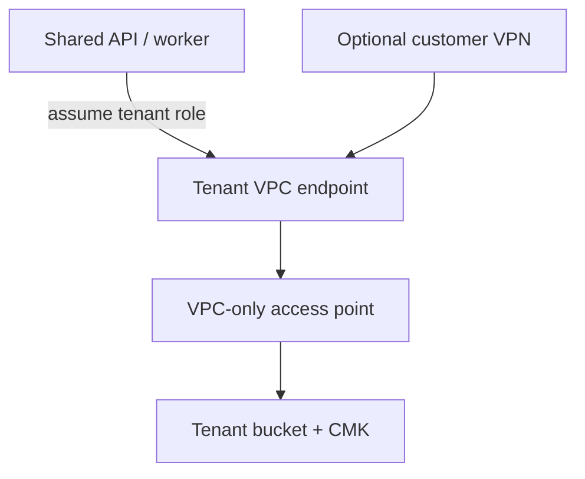

# Tenant data-plane and private S3 architecture

Every registered isolated data plane—whether `none` or `customer_vpn`—owns a
dedicated versioned S3 bucket, rotating KMS key, IAM role, VPC-only S3 access
point, and interface endpoint inside its tenant VPC.

The shared runtime has permission only to assume tenant storage roles. Each
role is restricted to its access point and CMK. Endpoint, access-point, bucket,
and KMS policies independently constrain the same path. Bucket policy denies
unencrypted transport, traffic outside the tenant VPCE, direct bucket access,
and writes without the exact tenant CMK.

## Lifecycle

1. Register a data plane with its S3 region. Status is `storage_pending`.
2. Apply Terraform and import the non-secret storage and network outputs.
3. Render/apply the isolated Teiid container and host firewall.
4. Run health. A write/head/read/delete probe must pass and report the exact
   CMK before storage changes to `ready`.
5. Bind the application tenant and explicitly provision VDBs. The plane can
   then become `active`.

Tenant-scoped upload, attachment, VDB creation, and VDB redeploy paths resolve
the binding from the organization. A bound but incomplete/unvalidated plane
raises `StorageIsolationError`; it never selects the global bucket.

Organizations without a data-plane record retain legacy shared storage for
backward compatibility.

## Boundary limitation

The VPC endpoint places S3 traffic in the customer's dedicated network and the
AWS policies prevent cross-tenant access. The API and worker still run on a
shared EC2 host, which is therefore trusted. Tenant-resident compute is needed
when the threat model includes compromise of the shared host/root account.

See `docs/devin-private-s3-merge-deploy.md` for deployment and negative tests.
